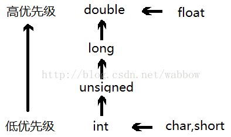

# C++ 数据类型

* [基本的内置类型](#基本的内置类型)
* [类型修饰符](#类型修饰符)
* [类型限定符](#类型限定符)
* [枚举类型](#枚举类型)
* [类型声明](#类型声明)
* [变量声明和定义](#变量声明和定义)
* [变量值类型](#变量值类型)
* [变量类型转换](#变量类型转换)
* [变量作用域](#变量作用域)
* [定义常量](#定义常量)


## 基本的内置类型

类型  |   关键字|存储值
------|--------|------------
布尔型 |   bool  | true 或 false。
字符型 |   char  | 通常是一个八位字节（一个字符）单引号,如果以L开头就为宽字符
整型  |   int    |对机器而言，整数的最自然的大小。 0x 或 0X 表示十六进制，0 表示八进制，不带前缀则默认表示十进制;后缀是 U 和 L 的组合，U 表示无符号整数（unsigned），L 表示长整数（long）
浮点型 |   float  | 单精度浮点值。单精度是整数部分、小数点、小数部分和指数部分组成，1位符号，8位指数，23位小数。 
双浮点型    |   double | 双精度浮点值。双精度是1位符号，11位指数，52位小数。
无类型 |   void  | 表示类型的缺失。
宽字符型    |   wchar_t | 宽字符类型，双引号。

转义序列    |   含义
--------|------------
\\\  |   \ 字符
\'  |   ' 字符
\"  |   " 字符
\?  |   ? 字符
\a  |   警报铃声
\b  |   退格键
\f  |   换页符
\n  |   换行符
\r  |   回车
\t  |   水平制表符
\v  |   垂直制表符
\ooo    |   一到三位的八进制数
\xhh . . .  |   一个或多个数字的十六进制数


## 类型修饰符

* signed
* unsigned
* short
* long

类型  |   位   |   范围
------|--------|-----------------
char    |   1 个字节   |   -128 到 127 或者 0 到 255
unsigned char   |   1 个字节   |   0 到 255
signed char |   1 个字节   |   -128 到 127
int |   4 个字节   |   -2147483648 到 2147483647
unsigned int    |   4 个字节   |   0 到 4294967295
signed int  |   4 个字节   |   -2147483648 到 2147483647
short int   |   2 个字节   |   -32768 到 32767
unsigned short int  |   2 个字节   |   0 到 65,535
signed short int    |   2 个字节   |   -32768 到 32767
long int    |   8 个字节   |   -9,223,372,036,854,775,808 到 9,223,372,036,854,775,807
signed long int |   8 个字节   |   -9,223,372,036,854,775,808 到 9,223,372,036,854,775,807
unsigned long int   |   8 个字节   |   0 to 18,446,744,073,709,551,615
float   |   4 个字节   |   +/- 3.4e +/- 38 (~7 个数字)
double  |   8 个字节   |   +/- 1.7e +/- 308 (~15 个数字)
long double |   16 个字节  |   +/- 1.7e +/- 308 (~15 个数字)
wchar_t |   2 或 4 个字节   |   1 个宽字符


**C++ 允许使用速记符号来声明无符号短整数或无符号长整数。您可以不写 int，只写单词 unsigned、short 或 unsigned、long，int 是隐含的**


## 类型限定符
类型限定符提供了变量的额外信息。

限定符|含义
------|-----------
const   |const 类型的对象在程序执行期间不能被修改改变。
volatile   | 修饰符 volatile 告诉编译器不需要优化volatile声明的变量，让程序可以直接从内存中读取变量。对于一般的变量编译器会对变量进行优化，将内存中的变量值放在寄存器中以加快读写效率。
restrict    |由 restrict 修饰的指针是唯一一种访问它所指向的对象的方式。只有 C99 增加了新的类型限定符 restrict。


## 枚举类型

 枚举类型(enumeration)是C++中的一种派生数据类型，它是由用户定义的若干枚举常量的集合。

```c++
enum 枚举名{ 
     标识符[=整型常数], 
     标识符[=整型常数], 
... 
    标识符[=整型常数]
} 枚举变量;
```

默认情况下，第一个标识符的值为 0，第二个标识符的值为 1，第三个标识符的值为 2，以此类推。每个标识符都会比它前面一个大 1。


## 类型声明

 typedef 为一个已有的类型取一个新的名字

 ```c++
 typedef type newname; 
 ```


## 变量声明和定义

* 变量声明：一般写在头文件中,告诉编译器保证变量以给定的类型和名称存在,不分配内存空间.
* 变量定义：一般写在源文件中,告诉编译器在何处创建变量的存储，以及如何创建变量的存储,分配内存空间

```c++
extern type variable_list;
type variable_list;
//例如
extern int d = 3, f = 5;    // d 和 f 的声明且初始化
int d = 3, f = 5;           // 定义并初始化 d 和 f
```
不带初始化的定义：带有静态存储持续时间的变量会被隐式初始化为 NULL（所有字节的值都是 0），其他所有变量的初始值是未定义的。


数据类型    |   初始化默认值
------------|-------------
int |   0
char    |   '\0'
float   |   0
double  |   0
pointer |   NULL


**C++ 中左值（lvalue）为内存地址，可以在右边存在；右值为数值只能放右边。**


## 变量值类型

* [数字](##数字)
* [数组](##数组)
* [字符串](##字符串)
* [指针](##指针)
* [引用](##引用)

### 数字

C++ 数学运算,需要引用数学头文件 <cmath>

序号  |   函数 & 描述
------|----------------
1   |   double cos(double);
    |   该函数返回弧度角（double 型）的余弦。
2   |   double sin(double);
    |   该函数返回弧度角（double 型）的正弦。
3   |   double tan(double);
    |   该函数返回弧度角（double 型）的正切。
4   |   double log(double);
    |   该函数返回参数的自然对数。
5   |   double pow(double, double);
    |   假设第一个参数为 x，第二个参数为 y，则该函数返回 x 的 y 次方。
6   |   double hypot(double, double);
    |   该函数返回两个参数的平方总和的平方根，也就是说，参数为一个直角三角形的两个直角边，函数会返回斜边的长度。
7   |   double sqrt(double);
    |   该函数返回参数的平方根。
8   |   int abs(int);
    |   该函数返回整数的绝对值。
9   |   double fabs(double);
    |   该函数返回任意一个十进制数的绝对值。
10  |   double floor(double);
    |   该函数返回一个小于或等于传入参数的最大整数


随机数
```c++
void srand(unsigned seed);

//1.播种 
srand((unsigned) time(NULL)); 

//2.要产生 [m,n] 范围内的随机数 num，可用：
int num=rand()%(n-m+1)+m; //（即 rand()%[区间内数的个数]+[区间起点值]） 
```

### 数组

数组是数据结构，由连续的内存位置组成。最低的地址对应第一个元素，最高的地址对应最后一个元素。

```c++
type arrayName [ arraySize ]; //arraySize如果为空，根据右边的复制个数决定

//访问数组元素,从零开始
arrayName[index] 

//多维数组
type name[size1][size2]...[sizeN]; 

//指向数组的指针  数组名是一个指向数组中第一个元素的常量指针
double *p;
double balance[10];
p = balance;

// 传递数组的指针给函数
void myFunction(int *param)
{
.
}

void myFunction(int param[10])
{
.
}

void myFunction(int param[])
{
.
}

// 从函数返回数组的指针
int * myFunction()
{
    static int  r[10];// static 变量能函数外返回局部变量的地址
.
}
```


### 字符串


* C风格字符串,字符串实际上是使用 null 字符 '\0' 终止的一维字符数组。

序号  |   函数 & 目的
-------|--------------
1   |   strcpy(s1, s2); 复制字符串 s2 到字符串 s1。
2   |   strcat(s1, s2); 连接字符串 s2 到字符串 s1 的末尾。
3   |   strlen(s1); 返回字符串 s1 的长度。
4   |   strcmp(s1, s2); 如果 s1 和 s2 是相同的，则返回 0；如果 s1<s2 则返回值小于 0；如果 s1>s2 则返回值大于 0。 
5   |   strchr(s1, ch); 返回一个指针，指向字符串 s1 中字符 ch 的第一次出现的位置。
6   |   strstr(s1, s2); 返回一个指针，指向字符串 s1 中字符串 s2 的第一次出现的位置。


* C++ 引入的 string 类类型

```c++
#include <iostream>
#include <string>
 
using namespace std;
 
int main ()
{
   string str1 = "Hello";
   string str2 = "World";
   string str3;
   int  len ;
 
   // 复制 str1 到 str3
   str3 = str1;
   cout << "str3 : " << str3 << endl;
 
   // 连接 str1 和 str2
   str3 = str1 + str2;
   cout << "str1 + str2 : " << str3 << endl;

    //定义一个string类对象
    string http = "www.runoob.com";

   //打印字符串长度
   cout<<http.length()<<endl;

    //拼接
    http.append("/C++");
    cout<<http<<endl; //打印结果为：www.runoob.com/C++

    //删除
    int pos = http.find("/C++"); //查找"C++"在字符串中的位置
    cout<<pos<<endl;
    http.replace(pos, 4, "");   //从位置pos开始，之后的4个字符替换为空，即删除
    cout<<http<<endl;

    //找子串runoob
    int first = http.find_first_of("."); //从头开始寻找字符'.'的位置
    int last = http.find_last_of(".");   //从尾开始寻找字符'.'的位置
    cout<<http.substr(first+1, last-first-1)<<endl; //提取"runoob"子串并打印

    return 0;
}
```

### 指针
指针是一个变量，其值为另一个变量的地址，即，内存位置的直接地址。

```c++
type *var-name;

//定义一个指针变量
int  var = 20;
int  *ip;

//把变量地址赋值给指针
ip = &var;

// 输出在指针变量中存储的地址
cout << ip << endl;

//访问指针变量中可用地址的值。
cout << *ip << endl;
 
//Null指针称为空指针,Null的值为零，防止误用一个未初始化的指针
int  *ptr = NULL; 

//指针的算术运算 ++、--、+、-，还可以使用 ==、< 和 >比较
int  var[MAX] = {10, 100, 200};
int  *ptr;
ptr++;

// 指针数组  *优先级小于 []
int *ptr[MAX];

//指向指针的指针
int **var;
```


### 引用
引用变量是一个别名

* 不存在空引用。引用必须连接到一块合法的内存。
* 一旦引用被初始化为一个对象，就不能被指向到另一个对象。指针可以在任何时候指向到另一个对象。
* 引用必须在创建时被初始化。指针可以在任何时间被初始化。

```c++
// 函数返回引用
//不能返回函数内部new分配的内存的引用
//可以返回类成员的引用，但最好是cons
int&  r = i;

int& func() {
   int q;
   static int x;
   return x;     // 安全，x 在函数作用域外依然是有效的
}

```


## 变量类型转换

变量的类型间是可以互相转换的，转换又分为隐式转换和强制转换。

以下四种情况下会进行隐式转换:

1. 算术运算式中，低类型能够转换为高类型。
2. 赋值表达式中，右边表达式的值自动隐式转换为左边变量的类型，并赋值给他。
3. 函数调用中参数传递时，系统隐式地将实参转换为形参的类型后，赋给形参。
4. 函数有返回值时，系统将隐式地将返回表达式类型转换为返回值类型，赋值给调用函数

算数运算的隐式转换



强制转换规则：

其一般形式为：（类型说明符）（表达式）把表达式的运算结果强制转换成类型说明符所表示的类型

无符号化为有符号的位数运算，采取 N-2^n,N为无符号数值，n为有符号的位数。

## 变量作用域

用域是程序的一个区域，一般来说有三个地方可以定义变量：

* 在函数或一个代码块内部声明的变量，称为局部变量。
* 在函数参数的定义中声明的变量，称为形式参数。
* 在所有函数外部声明的变量，称为全局变量。


* static 全局变量:只能定义文件使用，保持静态存储区分配空间
* static 局部变量：储区分配空间动态转换到静态
* static 函数：定义文件可见

## 定义常量
在 C++ 中，有两种简单的定义常量的方式：

* 使用 #define 预处理器。

    ```c++
    #define identifier value
    ```

* 使用 const 关键字。

    ```c++
    const type variable = value;
    ```

### 区别

* 类型和安全检查不同

    - 宏定义是字符替换，没有数据类型的区别，同时这种替换没有类型安全检查，可能产生边际效应等错误；
    - const常量是常量的声明，有类型区别，需要在编译阶段进行类型检查

* 编译器处理不同

    - 宏定义是一个"编译时"概念，在预处理阶段展开，不能对宏定义进行调试，生命周期结束与编译时期；
    - const常量是一个"运行时"概念，在程序运行使用，类似于一个只读行数据

* 存储方式不同

    宏定义是直接替换，不会分配内存，存储与程序的代码段中；const常量需要进行内存分配，存储与程序的数据段中


* 定义域不同

    宏定义不受定义域限制,通过#undef来使之前的宏定义失效,不能作为参数传递给函数。
