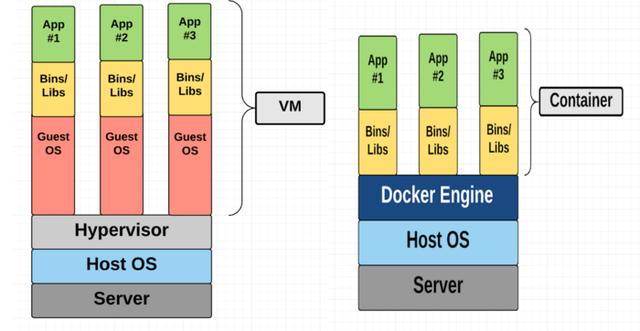
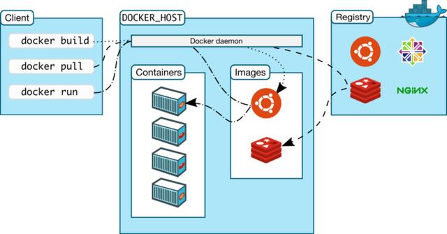

# 安装 Docker

Container(容器)是一种轻量级的虚拟化技术，它不需要模拟硬件创建虚拟机。在Linux系统里面，使用到Linux kernel的cgroups，namespace(ipc，network， user，pid，mount），capability等用于隔离运行环境和资源限制的技术，我们称之为容器。

Docker基于Linux kernel的CGroups，Namespace，UnionFileSystem等技术封装成一种自定义的容器格式，用于提供一整套虚拟运行环境。毫无疑问，近些年来Docker已经成为了容器技术的代名词，如其官网介绍的Docker is world's leading software containerization platform。

虚拟机和容器对比:

## Docker Engine

Docker提供了一个打包和运行应用的隔离环境，称之为容器，Docker的隔离和安全特性允许你在一个主机同时运行多个容器，而且它并不像虚拟机那样重量级，容器都是基于宿主机的内核运行的，它是轻量的，不管你运行的是ubuntu, debian还是其他Linux系统，用的内核都是宿主机内核。Docker提供了工具和平台来管理容器，而Docker Engine则是一个提供了大部分功能组件的CS架构的应用，如架构图所示，Docker Engine负责管理镜像，容器，网络以及数据卷等。

## Docker架构

Docker使用客户端-服务器 (C/S) 架构模式，client通过RESTFUL API发送docker命令到docker daemon进程，docker daemon进程执行镜像编译，容器启停以及分发，数据卷管理等，一个client可以与多个docker daemon通信。

容器与镜像的关系类似于面向对象编程中的对象与类。

|Docker|面向对象|
----|-----
|容器|对象
|镜像|类

docker 架构:
* Docker Daemon：Docker后台进程，用于管理镜像，容器以及数据卷。
* Docker Client：用于与Docker Daemon交互。
* Docker Registry：用于存储Docker镜像，类似github，公共的Registry有Docker Hub和Docker Cloud。
* Images：镜像是用于创建容器的一种只读模板。镜像通常基于一个基础镜像，在此基础上安装额外的软件。比如你的nginx镜像可能基于debian然后安装nginx并添加配置，你可以从Docker Hub上拉取已有的镜像或者自己通过Dockerfile来编译一个镜像。
* Containers：容器是镜像的一个可运行示例，我们可通过Docker client或者API来创建，启停或者删除容器。默认情况下，容器与宿主机以及其他容器已经隔离，当然你可以控制隔离容器的网络或者存储的方式。
* Services：服务是docker swarm引入的概念，可以用于在多宿主机之间伸缩容器数目，支持负载均衡已经服务路由功能。

|||
------|-------
|Docker 镜像(Images)	|Docker 镜像是用于创建 Docker 容器的模板。
|Docker 容器(Container)	|容器是独立运行的一个或一组应用。
|Docker 客户端(Client)	|Docker 客户端通过命令行或者其他工具使用 [Docker API](https://docs.docker.com/reference/api/docker_remote_api) 与 Docker 的守护进程通信。
|Docker 主机(Host)	    |一个物理或者虚拟的机器用于执行 Docker 守护进程和容器。
|Docker 仓库(Registry)	|Docker 仓库用来保存镜像，可以理解为代码控制中的代码仓库。[Docker Hub](https://hub.docker.com) 提供了庞大的镜像集合供使用。
|Docker Machine	Docker  |Machine是一个简化Docker安装的命令行工具，通过一个简单的命令行即可在相应的平台上安装Docker，比如VirtualBox、 Digital Ocean、Microsoft Azure。

## Docker底层技术
* Linux Namespaces(Linux2.6.24后引入)：命名空间用于进程(PID)、网络(NET)、挂载点(MNT)、UTS、IPC等隔离。
* Linux Control Groups(CGroups)：用于限制容器使用的资源，包括内存，CPU等。
* Union File Systems：UnionFS把多个目录结合成一个目录，对外使用，最上层目录为读写层(通常只有1个)，下面可以有一个或多个只读层，见容器和镜像分层图。Docker支持OverlayFS，AUFS、DeviceMapper、btrfs等联合文件系统。
* Container Format: Docker Engine组合Namespaces，CGroups以及UnionFS包装为一个容器格式，默认格式为libcontainer，后续可能会加入BSD Jails 或 Solaris Zones容器格式的支持。