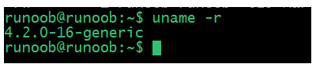
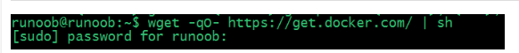
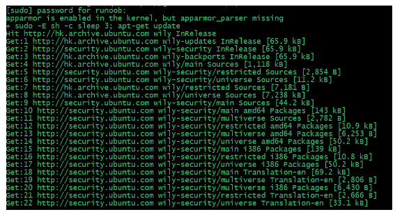
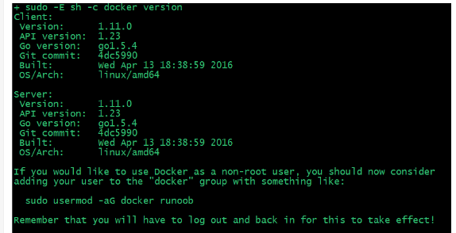
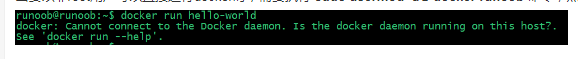
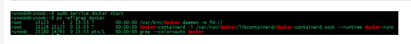

# Docker 安装

* [Ubuntu Docker 安装](#Ubuntu)
* [CentOS Docker 安装](#CentOS)
* [镜像加速](#镜像加速)


## Ubuntu

Docker 支持以下的 Ubuntu 版本：
* Ubuntu Precise 12.04 (LTS)
* Ubuntu Trusty 14.04 (LTS)
* Ubuntu Wily 15.10
* 其他更新的版本……

### 前提条件

Docker 要求 Ubuntu 系统的内核版本高于 3.10 ，查看本页面的前提条件来验证你的 Ubuntu 版本是否支持 Docker。

通过 uname -r 命令查看你当前的内核版本
```bash
runoob@runoob:~$ uname -r
```


### 使用脚本安装 Docker

1. 获取最新版本的 Docker 安装包
    ```bash
    runoob@runoob:~$ wget -qO- https://get.docker.com/ | sh
    ```
    

    输入当前用户的密码后，就会下载脚本并且安装Docker及依赖包。
    
    

    安装完成后有个提示：
    ```bash
        If you would like to use Docker as a non-root user, you should now consider
        adding your user to the "docker" group with something like:

        sudo usermod -aG docker runoob
    Remember that you will have to log out and back in for this to take effect!  
    ```
    **当要以非root用户可以直接运行docker时，需要执行 sudo usermod -aG docker runoob 命令，然后重新登陆，否则会有如下报错**
    


2. 启动docker 后台服务
```bash
runoob@runoob:~$ sudo service docker start
```


3. 测试运行hello-world
```bash
runoob@runoob:~$ docker run hello-world
```


## CentOS   

Docker支持以下的CentOS版本：
* CentOS 7 (64-bit)
* CentOS 6.5 (64-bit) 或更高的版本


#### 前提条件

目前，CentOS 仅发行版本中的内核支持 Docker。

Docker 运行在 CentOS 7 上，要求系统为64位、系统内核版本为 3.10 以上。

Docker 运行在 CentOS-6.5 或更高的版本的 CentOS 上，要求系统为64位、系统内核版本为 2.6.32-431 或者更高版本。

### 使用 yum 安装（CentOS 7下）

Docker 要求 CentOS 系统的内核版本高于 3.10 ，查看本页面的前提条件来验证你的CentOS 版本是否支持 Docker 。

通过 uname -r 命令查看你当前的内核版本
```bash
[root@runoob ~]# uname -r 
```

#### 安装 Docker

从 2017 年 3 月开始 docker 在原来的基础上分为两个分支版本: Docker CE 和 Docker EE。

Docker CE 即社区免费版，Docker EE 即企业版，强调安全，但需付费使用。

本文介绍 Docker CE 的安装使用。

* 移除旧的版本：
    ```bash
    $ sudo yum remove docker \
                    docker-client \
                    docker-client-latest \
                    docker-common \
                    docker-latest \
                    docker-latest-logrotate \
                    docker-logrotate \
                    docker-selinux \
                    docker-engine-selinux \
                    docker-engine
    ```      

* 安装一些必要的系统工具：
    ```bash
    sudo yum install -y yum-utils device-mapper-persistent-data lvm2
    ```

* 添加软件源信息：
    ```bash
    sudo yum-config-manager --add-repo http://mirrors.aliyun.com/docker-ce/linux/centos/docker-ce.repo
    ```

* 更新 yum 缓存：
    ```bash
    sudo yum makecache fast
    ```

* 安装 Docker-ce：
    ```bash
    sudo yum -y install docker-ce
    ```

* 启动 Docker 后台服务
    ```bash
    sudo systemctl start docker
    ```

* 测试运行 hello-world
    ```bash
    [root@runoob ~]# docker run hello-world
    ```

由于本地没有hello-world这个镜像，所以会下载一个hello-world的镜像，并在容器内运行。

### 使用脚本安装 Docker

1. 使用 sudo 或 root 权限登录 Centos。

2. 确保 yum 包更新到最新。
    ```bash
    $ sudo yum update
    ```

3. 执行 Docker 安装脚本。
    ```bash
    $ curl -fsSL https://get.docker.com -o get-docker.sh
    $ sudo sh get-docker.sh
    ```
    执行这个脚本会添加 docker.repo 源并安装 Docker。

4. 启动 Docker 进程。
    ```bash
    sudo systemctl start docker
    ```
5. 验证 docker 是否安装成功并在容器中执行一个测试的镜像。
    ```bash
    $ sudo docker run hello-world
    docker ps
    ```
    到此，Docker 在 CentOS 系统的安装完成。


### 删除 Docker CE
执行以下命令来删除 Docker CE：
```bash
$ sudo yum remove docker-ce
$ sudo rm -rf /var/lib/docker
```

## 镜像加速

鉴于国内网络问题，后续拉取 Docker 镜像十分缓慢，我们可以需要配置加速器来解决，我使用的是网易的镜像地址：http://hub-mirror.c.163.com。

新版的 Docker 使用 /etc/docker/daemon.json（Linux） 或者 %programdata%\docker\config\daemon.json（Windows） 来配置 Daemon。

请在该配置文件中加入（没有该文件的话，请先建一个）：
```bash
{
  "registry-mirrors": ["http://hub-mirror.c.163.com"]
}
```