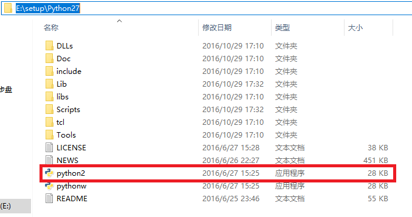
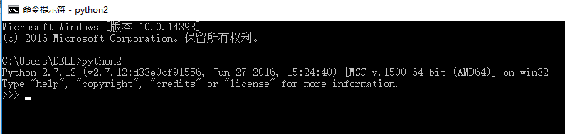
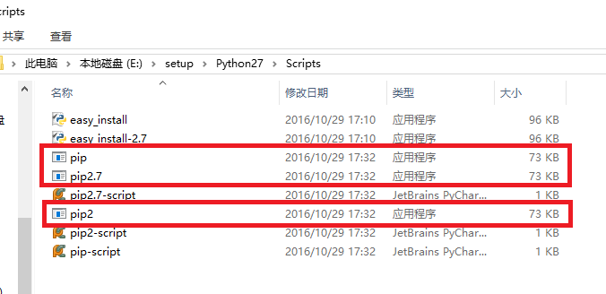
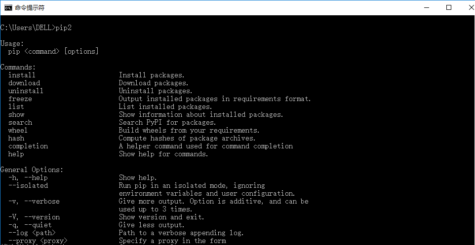
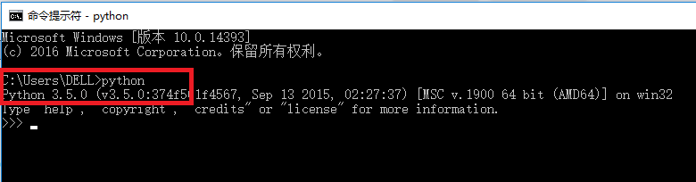
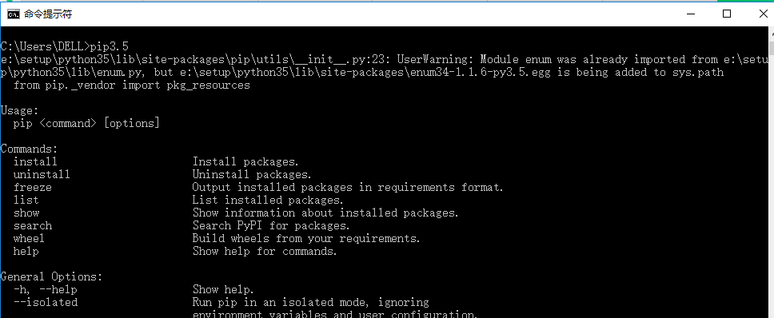

# 在同一台电脑上同时安装Python2和Python3
```
目前Python的两个版本Python2和Python3同时存在，且这两个版本同时在更新与维护。
到底是选择Python2还是选择Python3，取决于当前要使用的库、框架支持哪个版本。
例如：HTMLTestRunner、locustio支持Python2，但是不支持Python3。
所以很多时候，一台电脑上需要同时安装Python2和Python3。
```

本篇内容主要讲一下，在同一台电脑上如何同时安装Python2和Python3，且均可以正常使用pip。


1. 安装Python2（以及pip）

    1. 到Python的[官网](https://www.python.org/)下载Python的安装文件，

         对于Windows用户来说，如果是32位系统，则选择x86版本；如果是64位系统，则选择64版本的安装文件。

         我自己的电脑是64位，下面的例子按照64位进行说明。

         下载的安装文件的名字类似于这个样子：python-2.7.12.amd64.exe


    2. 点击“”python-2.7.12.amd64“”这个安装文件，一直点击next即可，在选择安装路径时需要特别注意：Python的安装路径不能有空格！

        为了区分是Python2还是Python3，把该目录下的python.exe文件重命名为python2.exe,如下面截图所示：

        


    3. 添加Python2的环境变量

         此电脑--属性--高级系统设置--高级--环境变量--系统变量--Path--编辑

         在此处添加   ;E:\setup\Python27\Scripts\;E:\setup\Python27\;   （此处根据自己的安装路径来写，且注意用英文分号和别的变量值隔开； 若不配置该变量，在cmd中输入Python2时会提示“不是内部命令”）


    4. 在cmd里，输入Python2，若出现下图中的提示，则表明Python2安装成功

        


    5. 安装setuptools。

         在步骤1.6中要安装的pip，依赖于setuptools，所以需要先安装setuptools，再安装pip。

         到[官网](https://pypi.python.org/pypi/setuptools )下载，名字类似于这个样子“”setuptools-28.7.0.zip“”(下载时间不一样，版本号可能会不一样)，进行解压；

         在cmd中进入到解压后的目录（既setup.py文件存在的目录），执行>python2 setup.py install  （注：由于前面步骤1.2中将python.exe文件重命名为了python2.exe，所以此处输入命令时一定要写python2，而不是python）


    6. 安装pip

       pip是安装和管理python包的工具，通过pip来安装python包变的十分简单。

       到[官网](https://pypi.python.org/pypi/pip) ，下载pip的压缩文件，下载后名字类似于这个样子“”pip-8.1.2.tar“”（下载时间不一样，版本号可能会不一样），进行解压；

       在cmd中进入到解压后的目录（既setup.py文件存在的目录），执行>python2 setup.py install （注：此处执行的命令为啥是pytho2，而不是python，原因同1.5一样）

       此时我们看一下Python2的pip的安装目录E:\setup\Python27\Scripts，看下面截图中，有pip、pip2.7、pip2，说明此时在cmd中执行pip或是pip2.7或是pip2，执行的都        是Python2的pip。

        

    7. 在cmd里输入pip2或是pip2.7，若出现以下截图中的内容，说明pip安装成功

        


2. 安装Python3（由于Python3自带pip，所以无需另外安装pip）

    1. 到Python的[官网](https://www.python.org/)下载Python3的安装文件，

       对于Windows用户来说，如果是32位系统，则选择x86版本；如果是64位系统，则选择64版本的安装文件。

       我自己的电脑是64位，下面的例子按照64位进行说明。

       下载的安装文件的名字类似于这个样子：python-3.5.0-amd64.exe


    2. 点击“”python-3.5.0-amd64.exe“”这个安装文件，一直点击next即可，在选择安装路径时需要特别注意：Python的安装路径不能有空格！


    3. 检查Python3的环境变量是否添加

       Python3在安装时可以选择自动添加环境变量，但是有时候却无法自动添加，所以此时自己确认一下。

       此电脑--属性--高级系统设置--高级--环境变量--系统变量--Path

       若没有有关Python3的环境变量，在此处添加   ;E:\setup\Python35\Scripts\;E:\setup\Python35\;   （此处根据自己的实际安装路径来写）


    4. 检查python3是否安装成功，在cmd中输入python，若显示如下图所示，是有关python3的版本，则说明python3安装成功。


        


      你可能有疑问：为什么这里不输入python3？  答：因为没有修改E:\setup\Python35目录下python.exe文件的名字为python3.exe。Python2里做了修改，所以这里修改不修改都无所谓，只要是能与E:\setup\Python27目录下的python.exe文件不重名即可。


    5. 验证Python3里pip是否自动安装成功

       在cmd里输入pip3或是pip3.5（此时输入pip看不出是Python2还是Python3中的pip），若有截图中的显示则表明Python3中pip自动安装成功。

        


       此时你可能有疑问，你怎么知道是输入pip3或是pip3.5，而不是pip3.6？因为在E:\setup\Python35\Scripts目录下pip.exe文件的名字决定的：如下图所示：


以上一和二将python2和python3 以及各自的pip安装完成。


3. 具体使用

若是在Python2中使用pip操作时，用pip2或是pip2.7相关命令。

      例：给Python2安装selenium，在cmd中输入 pip2 install selenium 或是 pip2.7 install selenium


若是在Python3中使用pip操作时，用pip3或是pip3.5相关命令。

      例：给Python3安装selenium，在cmd中输入 pip3 install selenium 或是 pip3.5 install selenium


若有的包不支持pip的安装形式，将相应的文件下载解压后放入到某个目录下，用cmd进入到解压后的目录

      若是给Python2安装该包，则执行python2 setup.py install

      若是给Python3安装该包，则执行python setup.py install


若文中内容有误，希望大家指正，谢谢。