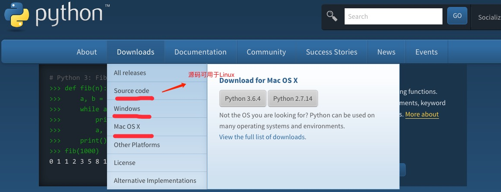
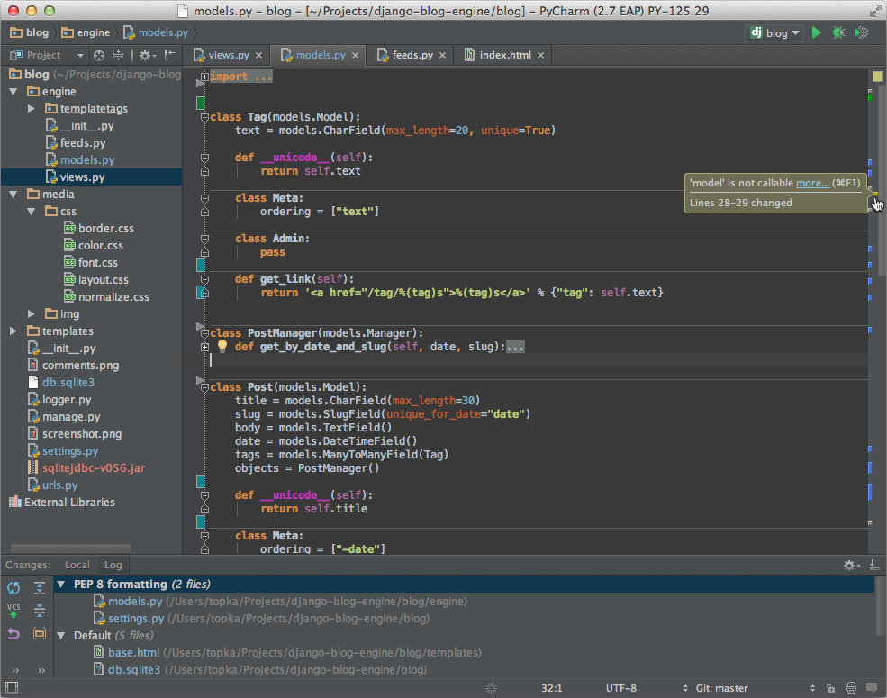

# Python 环境搭建
本章节我们将向大家介绍如何在本地搭建Python开发环境。

Python可应用于多平台包括 Linux 和 Mac OS X。
你可以通过终端窗口输入 "python" 命令来查看本地是否已经安装Python以及Python的安装版本。
* Unix (Solaris, Linux, FreeBSD, AIX, HP/UX, SunOS, IRIX, 等等。)
* Win 9x/NT/2000
* Macintosh (Intel, PPC, 68K)
* OS/2
* DOS (多个DOS版本)
* PalmOS
* Nokia 移动手机
* Windows CE
* Acorn/RISC OS
* BeOS
* Amiga
* VMS/OpenVMS
* QNX
* VxWorks
* Psion
* Python 同样可以移植到 Java 和 .NET 虚拟机上。


# Python下载

Python最新源码，二进制文档，新闻资讯等可以在Python的官网查看到：
[Python官网](https://www.python.org/)

你可以在以下链接中下载 Python 的文档，你可以下载 HTML、PDF 和 PostScript 等格式的文档。
[Python文档下载地址](https://www.python.org/doc/)


# Python安装
Python已经被移植在许多平台上（经过改动使它能够工作在不同平台上）。

您需要下载适用于您使用平台的二进制代码，然后安装Python。

如果您平台的二进制代码是不可用的，你需要使用C编译器手动编译源代码。

编译的源代码，功能上有更多的选择性， 为python安装提供了更多的灵活性。

以下是各个平台安装包的下载地址：



以下为不同平台上安装Python的方法：

1. **Unix & Linux 平台安装 Python:**

    以下为在Unix & Linux 平台上安装 Python 的简单步骤：
    * 打开WEB浏览器访问[链接](https://www.python.org/downloads/source/)
    * 选择适用于Unix/Linux的源码压缩包。
    * 下载及解压压缩包。
    * 如果你需要自定义一些选项修改Modules/Setup
    * 执行 ./configure 脚本
    * make
    * make install

    执行以上操作后，Python会安装在 /usr/local/bin 目录中，Python库安装在/usr/local/lib/pythonXX，XX为你使用的Python的版本号。

2. **Window 平台安装 Python:**

    以下为在 Window 平台上安装 Python 的简单步骤：
    * 打开 WEB 浏览器访问[链接](https://www.python.org/downloads/windows/)
    * 在下载列表中选择Window平台安装包，包格式为：python-XYZ.msi 文件 ， XYZ 为你要安装的版本号。
    * 要使用安装程序 python-XYZ.msi, Windows系统必须支持Microsoft Installer 2.0搭配使用。只要保存安装文件到本地计算机，然后运行它，看看你的机器支持MSI。Windows XP和更高版本已经有MSI，很多老机器也可以安装MSI。
    * 下载后，双击下载包，进入Python安装向导，安装非常简单，你只需要使用默认的设置一直点击"下一步"直到安装完成即可。

3. **MAC 平台安装 Python:**

    最近的Macs系统都自带有Python环境，你也可以在[链接](https://www.python.org/downloads/mac-osx/)上下载最新版安装。

# 环境变量配置
程序和可执行文件可以在许多目录，而这些路径很可能不在操作系统提供可执行文件的搜索路径中。

path(路径)存储在环境变量中，这是由操作系统维护的一个命名的字符串。这些变量包含可用的命令行解释器和其他程序的信息。

Unix或Windows中路径变量为PATH（UNIX区分大小写，Windows不区分大小写）。

在Mac OS中，安装程序过程中改变了python的安装路径。如果你需要在其他目录引用Python，你必须在path中添加Python目录。

1. **在 Unix/Linux 设置环境变量**
    * **在 csh shell:** 输入
        ```csh
        setenv PATH "$PATH:/usr/local/bin/python"
        ```
        , 按下"Enter"。
    * **在 bash shell (Linux):** 输入
        ```bash
        export PATH="$PATH:/usr/local/bin/python"
        ```
        ，按下"Enter"。
    * **在 sh 或者 ksh shell:** 输入
        ```ksh
        PATH="$PATH:/usr/local/bin/python"
        ```
        , 按下"Enter"。

    **注意:** /usr/local/bin/python 是 Python 的安装目录。

2. **在 Windows 设置环境变量**

    在环境变量中添加Python目录：

    **在命令提示框中(cmd) :** 输入
    ```dos
    path=%path%;C:\Python
     ```
     按下"Enter"。
    **注意:** C:\Python 是Python的安装目录。
    也可以通过以下方式设置：
    * 右键点击"计算机"，然后点击"属性"
    * 然后点击"高级系统设置"
    * 选择"系统变量"窗口下面的"Path",双击即可！
    * 然后在"Path"行，添加python安装路径即可(我的D:\Python32)，所以在后面，添加该路径即可。 ps：记住，路径直接用分号"；"隔开！
    * 最后设置成功以后，在cmd命令行，输入命令"python"，就可以有相关显示。

    

# Python 环境变量
下面几个重要的环境变量，它应用于Python：

|变量名|描述|
---- | ----
|PYTHONPATH     |PYTHONPATH是Python搜索路径，默认我们import的模块都会从PYTHONPATH里面寻找。
|PYTHONSTARTUP	|Python启动后，先寻找PYTHONSTARTUP环境变量，然后执行此变量指定的文件中的代码。
|PYTHONCASEOK	|加入PYTHONCASEOK的环境变量, 就会使python导入模块的时候不区分大小写.
|PYTHONHOME	    |另一种模块搜索路径。它通常内嵌于的PYTHONSTARTUP或PYTHONPATH目录中，使得两个模块库更容易切换。

# 运行Python
有三种方式可以运行Python：
1. 交互式解释器：

    你可以通过命令行窗口进入python并开在交互式解释器中开始编写Python代码。

    你可以在Unix，DOS或任何其他提供了命令行或者shell的系统进行python编码工作。
    ```
    $ python # Unix/Linux

    或者

    C:>python # Windows/DOS
    ```
    以下为Python命令行参数：

    |选项|描述|
     ----|----
    |-d	    |在解析时显示调试信息
    |-O	    |生成优化代码 ( .pyo 文件 )
    |-S	    |启动时不引入查找Python路径的位置
    |-V	    |输出Python版本号
    |-X	    |从 1.6版本之后基于内建的异常（仅仅用于字符串）已过时。
    |-c     |cmd	执行 Python 脚本，并将运行结果作为 cmd 字符串。
    |file	|在给定的python文件执行python脚本。

2. 命令行脚本

    在你的应用程序中通过引入解释器可以在命令行中执行Python脚本，如下所示：
    ```
    $ python script.py # Unix/Linux

    或者

    C:>python script.py # Windows/DOS
    ```
    注意:在执行脚本时，请检查脚本是否有可执行权限。

3. 集成开发环境（IDE：Integrated Development Environment）: PyCharm

    PyCharm 是由 JetBrains 打造的一款 Python IDE，支持 macOS、 Windows、 Linux 系统。

    PyCharm 功能 : 调试、语法高亮、Project管理、代码跳转、智能提示、自动完成、单元测试、版本控制……

    [PyCharm](../../../03.tool/IDETool/JetBrains/Pycharm/README.md)

    