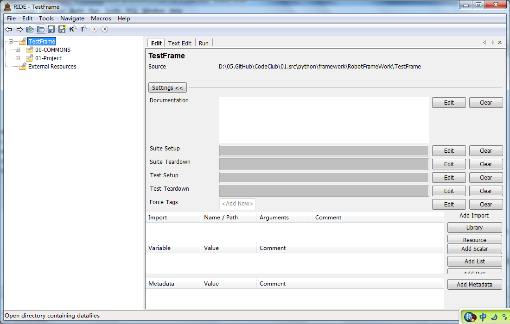

# 安装指导

本文简单介绍了Robot Framework的概要信息以及如何安装和执行第一个Robot的Helloworld的测试脚本，
同时确认了其输出的结果。Robot的强大在这个测试脚本中完全无法得到体现，后续会慢慢展开Robot Framework的各种使用方法。

**1.需要使用到的环境和工具**

- [Python2](https://www.python.org/)

        Robot framework是基于Python的，需要有Python基础环境，最好选用2.7版本，目前不兼容Python3。
  
- [wxPython](https://www.wxpython.org/pages/downloads/)
  
        一个著名的Python GUI库，用于支持后面的RIDE图形化操作工具。

- [Robot framework](https://pypi.python.org/pypi/robotframework/2.8.5)
  
        Robot framework框架本身，这里不多做介绍。

- [Robot framework-ride](https://pypi.python.org/pypi/robotframework-ride)
        
        Robot framework IDE 缩写为RIDE，一个拥有图形化界面的用于创建、组织、运行测试的工具。后续章节的示例操作都是基于RIDE来进行的。

- [Robot framework-selenium2library](https://pypi.python.org/pypi/robotframework-selenium2library/1.5.0)
        
        Robot framework版的selenium库,里面封装了核心的系统操作和需要使用到的关键字。
 
- [geckodriver](https://github.com/mozilla/geckodriver/releases), [chromedriver](http://chromedriver.storage.googleapis.com/index.html) 和 [IEDriverServer](http://selenium-release.storage.googleapis.com/index.html) （浏览器驱动，47以上的版本Firefox驱动也不再是默认包含）

- requests(Robot framework-requests库包，基于urllib编写的，采用的是Apache2 Licensed开源协议的HTTP库)


- Robot framework-requests(HTTP请求库)
    

- [AutoItLibrary](https://code.google.com/archive/p/robotframework-autoitlibrary/downloads)（Autoit库包，用于进行Windows GUI的自动化操作）

- [pywin32](https://sourceforge.net/projects/pywin32/files/pywin32/Build%20219/)（Autoit的运行环境）

- [Autoit](https://www.autoitscript.com/site/autoit/downloads/)（对于操作系统是32位的朋友，就不需要安装autoit了。 AutoIt没有64位的版本，直接下载并安装AutoIt Full Installation可执行文件。）
    

**2.安装方法**
- windows 
    (1)传统方法是分别到各个网站下载相应的安装包，顺序完成安装。
    注意完成Python安装后，需要先手动配置环境变量，默认安装路径即C:\Python27，另外需要配置上C:\Python27\Scripts。
    
    (2)使用pip安装
        ```
        pip install wxPython
        pip install robotframework
        pip install robotframework-ride
        pip install robotframework-selenium2library
        pip install Requests
        pip install RequestsLibrary
        ```

- 安装遇到问题
   
**3.使用方法**
在命令行中输入ride.py（完整路径是C:\Python27\Scripts\ride.py，因为已经配置了相应环境变量），即可打开RIDE工具。

如果是第一次打开，没有数据，界面上会显示一些提示语。这里是已经有测试用例操作后的默认打开界面，所以界面展示可能不一样。



