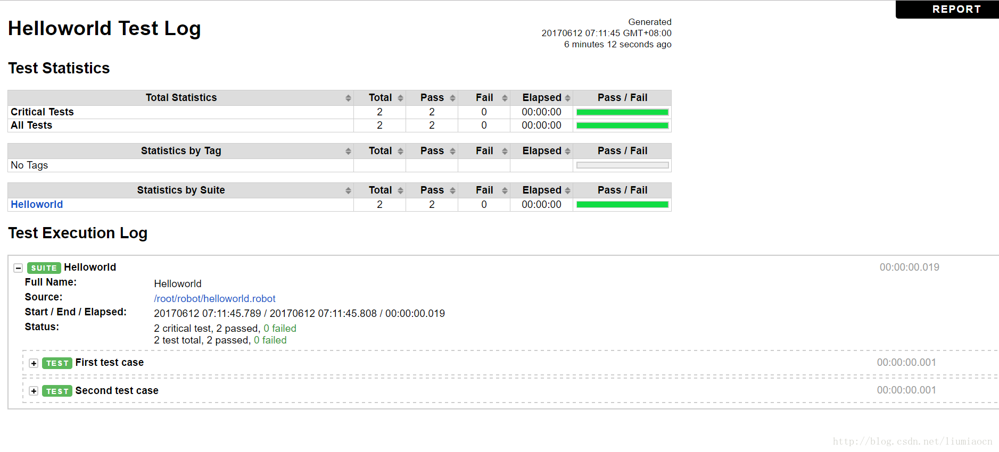
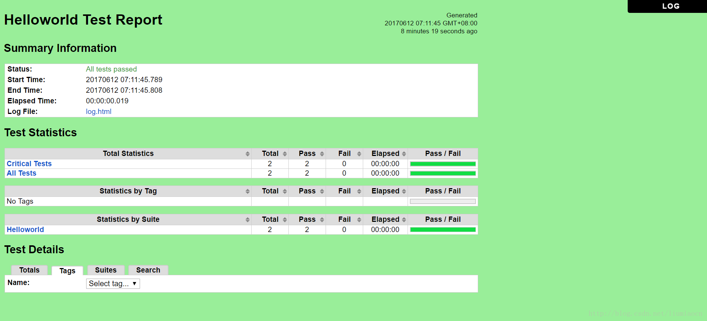
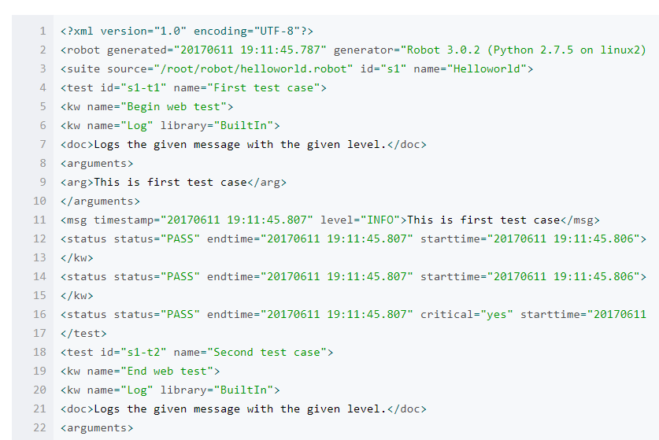

# robot framewrok

　　Robot Framework是一个基于Python可扩展地关键字驱动的测试自动化框架，使用Apache License 2.0，由Robot Framework Foundation
　　开发和赞助。Robot Framework被广泛地使用在端到端地验收测试以及ATDD（acceptance-test-driven development ）中，
　　生态体系非常丰富，更详细的信息可以参看[官网](http://robotframework.org/)。

## 优点:

1. 使用简单
通过表格式语法创建和组织测试用例，就像在Exel里编辑数据一样进行编写测试用例。

2. 日志详细
    * 2.1 日志文件(log.html)

    

    * 2.2结果报表(report.html)

    

    *  2.3输出文件(output.xml)
    详细的输出信息，可以使用其进行更方便的持续集成。

    

3. 丰富的类库支持不同平台、不同类型的应用测试
Web自动化测试：SeleniumLibrary，Selenium2Library等
Windows GUI测试：AutoItLibrary
数据库测试：Database Library(Java)、Database Library (Python)、MongoDB library等
文件对比测试：Diff Library
HTTP测试：HTTP library (livetest)、HTTP library (Requests)

4. 可以像编程一样编写测试用例 
虽然是表格式语法，但是通过使用Builtin库中的循环、判断、变量等可以像编程一样构造出复杂的逻辑，调用Python函数也是可以的。 

5. 支持利用用户和系统关键字进行二次开发
用户关键字是类似封装把用例公共部分封装成函数,重复利用.
系统关键字是支持用python和java封装成方法提供给用例
    
    
## 相关资料

1. 安装指导
    * [python2安装指导](Install.md)
    * [python3安装指导](Install3.md)   
2. [使用说明](Instruction.md)
3. [并行执行用例](并行执行用例.md)
4. [项目](../../03.Project/RobotFramework/README.md)