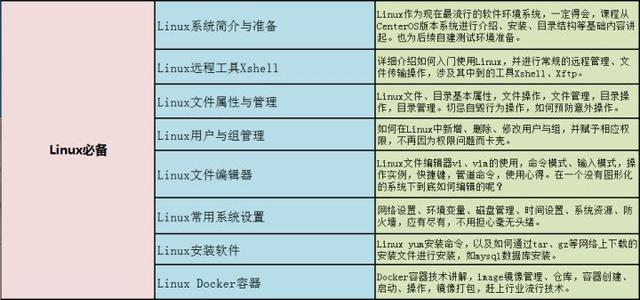
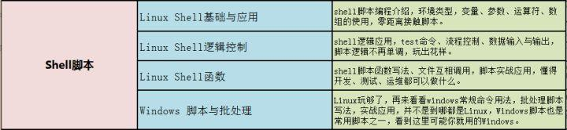
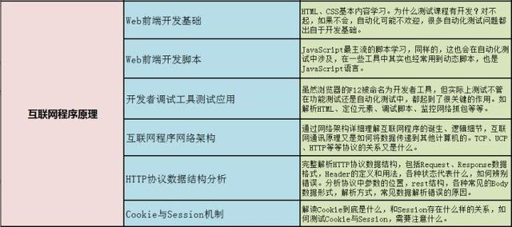
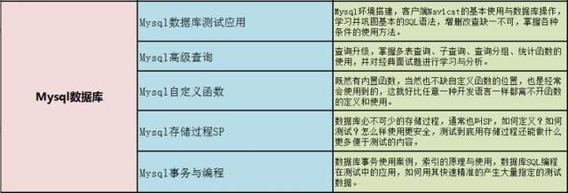
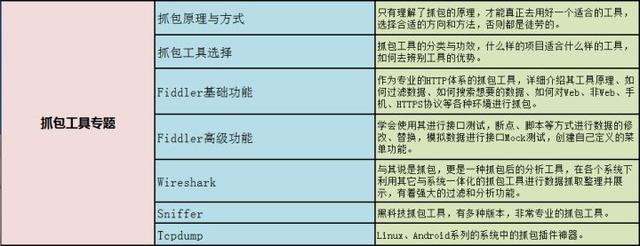
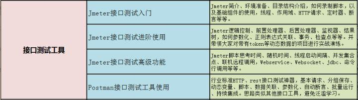
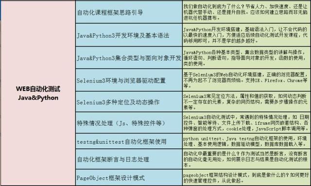
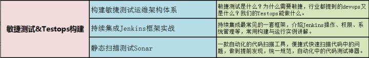
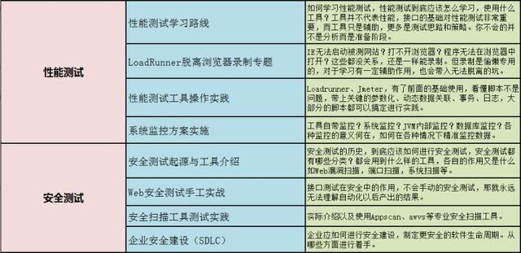

# 基本技能

* 一、Linux必备知识
    > 　　linux作为现在最流行的软件环境系统，一定需要掌握，目前的招聘要求都需要有linux能力。

    

* 二、Shell脚本
    > 　　掌握shell脚本，包括shell基础与应用、shell逻辑控制、shell逻辑函数等。

    

* 三、互联网程序原理
    > 　　自动化必由之路：前端开发基础知识以及互联网网络必备知识。

    

* 四、Mysql数据库
    > 　　软件测试工程师必备Mysql数据库知识，不仅仅停留在基本的“增删改查”。

    

* 五、抓包工具
    > 　　Fiddler、Wireshark、Sniffer、Tcpdump各种抓包工具适用于各种项目，总有一款适合你。

    

* 六、接口测试工具
    > 　　接口测试神器，你绕不开的强大工具：Jmeter。小巧灵活：Postman。

    

* 七、Web自动化测试Java&Pyhton
    > 　　了解自动化的目的，熟练掌握testng&unittest自动化框架，以及断言与日志处理。

    

* 八、接口与手机自动化
    > 　　专业接口调用、测试解决方案。组建完整的web和接口自动化框架，Appium整体使用。

    

* 九、敏捷测试&TestOps构建
    > 　　揭开TestOps的神秘面纱，持续集成Jenkins框架烂熟于心。

    

* 十、性能测试&安全测试
    > 　　软件测试的彼岸：性能测试和安全测试，选对方向，努力爬坑吧！

    