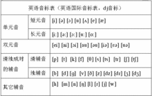
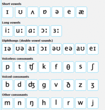

#音标
* 1.国际音标编辑
    * 1.国际音标（IPA，International Phonetic Alphabet），是1888年国际语音协会（International Phonetic Association）的语言学家制定出的一套可国际通用的语音符号叫国际音标符号（IPA—International Phonetic Alphabet），希望以一个符号代表一音，避免各人使用一套自己的符号所产生的不便。
    * 2.国际音标，如其名，是设计来标注国际各种语言的发音的，很多语言学家把国际音标做局部修改以标记他们所研究的语言，所以国际音标也有很多种。
    * 3.一些国家和地区的英语教学课程采用国际音标，例如中国大陆、中国台湾、俄罗斯。
* 2.英式音标编辑
    * 1.就是通常我们说的英式发音音标，由英国语音学家Daniel Jones研究出，英式发音的国际音标由他的姓名首字母缩写DJ表示。
    * 2.英国语音学家Daniel Jones根据IPA编了一本英国英语的发音辞典《英语正音辞典》（English Pronouncing Dictionary）。这本辞典后来成为一种典范。它代表了被称为“Received Pronunciation”（RP）（标准读音）的读音，这在受过教育的英国人尤其是南部英格兰人中通用。
    * 3.以下的音标表是国内采用的DJ音标：  
    
    
    * 4.英语音标在不断改进，这个传统的DJ音标表里的二个清辅音( /tr/、/ts/)和二个浊辅音( /dr/、/dz/ )，在BBC English网站上的音标表中，已经被去掉。从而与美式音标的辅音完全一样，英式音标也是24个辅音。目前BBC的音标符号共计有44个，其中辅音有24个，元音有20个。
    * 5.看看现在BBC网站的音标表吧，不但数量变化了，连外形都有点改观：
    

* 3.美式音标编辑

        K.K.音标，俗称美式音标，由美国两位语言学家John S. Kenyon和Thomas A. Knott共同研究出来的。
        K.K.音标，是《美式英语发音辞典》（A Pronouncing Dictionary of American English）所使用的音标。此本辞典在1944年首次出版，由于两位作者John Samuel Kenyon及Thomas A. Knott的姓皆以K为开头，所以此辞典俗称为K.K.（Kenyon and Knott）。K.K.音标的主要用途之一是教导母语非英语者学会美式英语的发音，K.K.音标的使用区域越来越多，现今在台湾被广为采用，中国大陆也在逐渐推广，属于当前流行的音标学习种类。
        以下音标表以美国Iowa大学网上的音标表为标准:
        
        英式音标和美式音标都是国际音标编辑
        有人认为国际音标就是标注英式英语发音的音标，而K.K.是标美国音的。这种说法把国际音标说成好像只能用来标英国音，而且把K.K.音标认为不是国际音标。其实这是不正确的。DJ英式音标和K.K.美式音标都是IPA国际音标。
        以下是英式音标与美式音标的对照表：

* 4.元音

        美式元音（18个）
        单元音：/i/ /ɪ/ /e/ /ɛ/ /æ/ /a/ /ʌ/ /ə/ /ɚ/ /ɝ/ /o/ /ɑ/ /ɔ/ /ʊ/ /u/
        双元音：/aɪ/ /aʊ/ /ɔɪ/
        注：有的地方将/a/写作/ɑ/，有时习惯上也将单元音/o/的位置读成双元音/oʊ/，将单元音/e/的位置读成双元音/eɪ/。
        英式元音（20个）
        单元音：/i:/ /ɪ/ /e/ /æ/ /ɜ/ /ə/ /ʌ/ /ɔ:/ /ɒ/ /u:/ /ʊ/ /ɑ:/
        双元音：/aɪ/ /eɪ/ /aʊ/ /əʊ/ /ɔɪ/ /ɪə/ /eə/ /ʊə/
        注：美式音标中摈弃了英式音标中的长元音符号 /:/，这是英式与美式音标书写上的最大区别！
* 5.辅音（30个）
    * 1.对立辅音（22个）
    
            注：下面音标的每一对当中，左边是清辅音，右边是浊辅音。
            双唇塞音/p/：pit-/b/：bit
            英语国际音标
            英语国际音标
            齿龈塞音/t/：tin-/d/：din
            软腭塞音/k/：cut-/ɡ/：gut
            齿龈塞擦音/ts/：its-/dz/：goods
            塞擦音 /tr/ tree-/dr/ drink
            齿龈塞擦音/tʃ/：cheap-/dʒ/：jeep
            唇齿擦音/f/：fat-/v/：vat
            齿间擦音/θ/：thin-/ð/：then
            齿龈擦音/s/：son-/z/：zip
            齿龈后擦音/ʃ/：sugar-/ʒ/：seizure
            软腭无擦通音/w/：whine-/w/：we
    * 2.鼻音（3个）
    
            浊辅音。 发音时软腭下垂,使气流从鼻腔逸出而产生的一种语音。
            双唇鼻音/m/：map
            齿龈鼻音/n/：nap
            软颚鼻音/ŋ/：hang
            近音（4个）
            声门擦音/h/：ham（清辅音）
            齿龈无擦通音/r/：run（浊辅音）
            齿龈边音/l/：left（浊辅音）
            软腭化齿龈边音/ɫ/：cancel（浊辅音）
    * 3.半元音（3个） 
    
            语音学上指擦音中气流较弱，摩擦较小，介于元音跟辅音之间的音。
            软腭无擦通音/ʍ/：whine（也写成/hw/，仅用于美语）-/w/：we
            硬腭无擦通音/j/：yes（浊辅音）      
    * 4.成音节辅音
    
            成音节辅音共有/ɫ/、/n/、/m/三个。它们也可以与前面的辅音拼在一起，形成音节。可在成音节辅音下方加上一点（.），写成/l̩/、/n̩/、/m̩/。例如：
            /l̩/：bottle
            /n̩/：button
            /m̩/：rhythm
    * 5.几种常见的音位变体
    
            1.齿音闪音[ɾ]：better,city,writing（浊辅音；非词首、非重读音节t的发音；多见于北美与澳洲英语）
            2.喉塞音[ʔ]：curtain,botton（清辅音；非词首、非重读音节/t/与/n/构成成音节时，字母t的发音；多见北美英语、Eastury英语和Cockney英语）,(ʔ)uh-(ʔ)oh
            3.如果清爆破音位于s后面，且处于词首或者是非重读音节的话，通常不送气（类似于汉语拼音的b，d，g）。
            例如：
     
    |清爆破音p，t，k送气（一般情况）|清爆破音p，t，k不送气	（p，t，k位于s之后，且处于词首或非重读音节）| 
    |:--------|:-------:|   
    
    |单词	|发音	|单词	|发音|
    |:--------|:--------|:--------|:-------:|  
    |peak	|/pi:k/	|speak	|/spi:k/|
    |top	|/tɒp/	|stop	|/stɒp/|
    |Kate	|/keɪt/	|skate	|/skeɪt/|
* 6.发音规则

        英语中同一个字母有很多不同的发音规则，以下简单总结了元音字母的一些发音规则，供大家参考。
        1. 元音字母在重读音节中的读音
        a 在开音节中 /eɪ/
        如：name plane Jane baby cake make take
        在闭音节中 /æ/
        如：bag dad hat map black back
        e 在开音节中 /i:/
        如：he these me Chinese bee green tree
        在闭音节中 /e/
        如：bed let pen desk yes
        i（y） 在开音节中 /aɪ/
        如：bike fly drive time nice kite
        在闭音节中 /ɪ/
        如：fish big drink sit milk swim pig six
        o 在开音节中 /əʊ/
        如：those close go hoe home no
        在闭音节中 /ɒ/，美式英语中经常发/ɑ/
        如：clock not box shop sock doll orange dog
        u 在开音节中 /ju:/
        如：student excuse duty Tuesday
        在闭音节中 /ʌ/
        如：bus cup jump much lunch duck
        在开音节中，元音字母u在辅音字母j，l，r，s后面时读/u:/音，例如：June blue ruler super
        2. 元音字母在非重读音节中的读音
        a /ə/ China another breakfast pedal
        /ɪ/ orange comrade village cabbage
        e /ə/ hundred student open children
        /ɪ/ chicken pocket begin
        /ə/或/ɪ/ holiday beautiful family animal
        /aɪ/ exercise satellite
        o /ə/ second tonight somebody welcome control
        /əʊ/ also zero photo
        u /ə/ autumn difficult
        /ju:/ popular congratulation January
        3. 元音字母在重读音节中的特殊读音
        a在/w/音后面/ɒ/ want what watch wash quality
        a在f，n，sk，ph，sp，ss，st，th前/ɑ:/
        after plant graph ask grasp glass fast father
        i在-nd，-ld和-gh前/aɪ/ find child light high
        o在-st，-ld前/əʊ/ most postcard old cold
        o在m，n，v，th前u /ʌ/ come monkey love mother
* 7.发音方法

        英语国际音标发音方法：本文为你介绍英语国际音标发音方法，助你轻松简单学英语。
        /i:/ 舌抵下齿，双唇扁平作微笑状，发“一”之长音。 是字母ea、ee、ey、ie、或ei在单词中的发音，此音是长元音，一定注意把音发足。
        /ɪ/ 舌抵下齿，双唇扁平分开，牙床近于全舌，发短促之“欸(ei)”音。 是字母i或y在单词中的发音，发此音要短促而轻快。
        /æ/ 双唇扁平，舌前微升，舌尖抵住下龈，牙床开，软鄂升起，唇自然开放。 是字母a在闭音节或重读闭音节中的发音
        /e/ 舌近硬腭，舌尖顶下齿，牙床半开半合，作微笑状。 是字母e或ea在单词中的发音
        /з:/ 舌上抬，唇成自然状态，口半开半闭，发“厄”之长音。 是字母er、ir、or或ur在单词中的发音
        /ə/ 舌上抬，唇成自然状态，口半开半闭，发“厄”之短音。 是字母a、o、u、e、or、er或ur在单词中的发音
        /ɑ:/ 双唇张而不圆，牙床大开，舌后微升，舌尖向后升缩微离下齿，发阿之长音。 是字母er在闭音节或重读闭音节中的发音也是字母a在以st结尾的单词中的读音。
        /ʌ/ 双唇平放，牙床半开，舌尖抵住下龈，舌后微微升起，发短促之“阿”音 是字母o或u在单词中的发音
        /ɔ:/ 双唇界于开闭、圆唇之间，牙床半开渐至全开，舌尖卷上再过渡为卷后。 是字母o、al、or、oar、our或oor在单词中的发音
        /ɒ/ 双唇稍微向外突出圆形，舌后升起，舌尖不触下齿，发“奥”音 是字母o在单词中的发音
        /u:/ 双唇成圆形，牙床近于半合，舌尖不触下齿，自然而不用力，发 “屋”之长音。 是字母oo或ou在单词中的发音
        /ʊ/ 双唇成圆形，牙床近于半合，舌尖不触下齿，自然而不用力，发短促之“屋”音。 是字母u、oo或ou在单词中的发音
        /aɪ/ 将口张开略圆，舌后升起，舌尖向后收缩，由发“阿”音平稳过渡到发“一”音。 是字母i或y在单词中的读音
        /eɪ/ 舌类顶下齿，牙床半开半合，双唇扁平，由发“哀”平稳过渡到发“一”之长音。 是字母a在开音节中的读音。
        /aʊ/ 将口张开略圆，渐渐合拢，双唇成圆形，由发“阿”音平稳过渡到发“屋”音。 是字母ou和ow在单词中的发音
        /əʊ/ 口半开半合，舌后微升，过渡成双唇成圆形，发“欧”之长音。 是字母o、oa和oe在单词中的发音
        
        　　/ɪə/ 双唇张开岈床由窄至半开舌抵下齿逐渐过渡至上卷，从“一”音过渡到“厄”音。 是字母ear、ere、ea、eer在单词中的读音
        /eə/ 双唇张开后略圆，牙床张开相当宽，舌尖卷上渐至卷后。 是字母ear、are、air在单词中的读音
        /ʊə/ 双唇成圆形，牙床近于半合，舌尖不触下齿，发“屋”之长音，然后从“屋”音过渡到“厄”音。 是字母our、oor、ure、eer在单词中的读音
        /ɔɪ/ 双唇外突成圆形，发“奥”音逐渐过渡为双唇扁平分开，发“一”之短音。 是字母oy和oi在单词中的读音
        /p/ 双唇紧闭并使气流突破双唇外泻。
        /b/ 双唇紧闭并使气流突破双唇外泻，须振动声带。
        /t/ 双唇微开，先用舌尖抵上齿龈，然后突然张开，使气流外冲而成音。
        /d/ 双唇微开，先用舌尖抵上齿龈，然后突然张开，使气流外冲而成音，须振动声带。
        /k/ 用舌根抵住后颚，再突然张开，使空气外冲而成音。
        /g/ 用舌根抵住后颚，再突然张开，使空气外冲而成音，须振动声带。
        /s/ 双唇微开，上下齿接近于合拢状态，舌尖抵住下龈，气流从牙缝送出。
        /z/ 双唇微开，上下齿接近于合拢状态，舌尖抵住下龈，气流从牙缝送出，须振动声带。
        /f/ 上齿轻触下唇，用力将气息由唇齿之缝隙间吹出。
        /v/ 上齿轻触下唇，用力将气息由唇齿之缝隙间吹出，须振动声带。
        /ʍ/ 双唇突出，呈尖圆形，舌后升向软颚，气息流过，相当于/hw/。
        /w/ 双唇突出，呈尖圆形，舌后升向软颚，气息流过，须振动声带。
        /∫/ 双唇微开，向前突出，舌尖升近上龈，用力将气息送出来。
        /ʒ/ 双唇微开，向前突出，舌尖升近上龈，用力将气息送出来，须振动声带。
        /h/ 口半闭，气息由声门出来，但是不振动声带。
        /j/ 双唇微开，舌抵下齿贴近硬颚，气流摩擦而出。
        /l/ 双唇微开，舌抵上龈，气流侧出，振动声带。
        /r/ 唇形稍圆，舌身略凹，舌尖上卷，振动声带。
        /m/ 双唇闭拢，舌放平，振动声带，使气流从鼻腔出来。
        /n/ 双唇微闭，舌尖抵住上龈，振动声带，使气流从鼻腔出来。
        /ŋ/ 双唇微闭，舌尖抵住下龈，振动声带，使气息由鼻孔流出来。
        /θ/ 上下齿咬舌尖，送出气流，并使舌齿互相摩擦。
        /ð/ 上下齿咬舌尖，送出气流，并使舌齿互相摩擦，须振动声带。
        /t∫/ 双唇微开，先用舌尖抵上齿龈，突然张开，使气流外冲而成音。
        /dʒ/ 双唇微开，先用舌尖抵上齿龈，突然张开，使气流外冲而成音，须振动声带。
        /ts/ 舌尖抵住上齿，作好发“t”的姿势，气流冲破阻碍，发出短促的“t”音后，紧接着就发“s”这摩擦音。
        /dz/ 舌尖抵住上齿，作好发“d”的姿势，气流冲破阻碍，发出短促的“d”音后，紧接着就发“z”这摩擦音。
        /tr/ 舌尖抵住上齿，作好发“t∫”的姿势，气流冲破阻碍，发出短促的“t”音后，紧接着就发“r”这摩擦音。
        /dr/ 舌尖抵住上齿，作好发“dʒ”的姿势，气流冲破阻碍，发出短促的“d”音后，紧接着就发“r”这摩擦音。
        在学习音标时，以下几个事项需要注意：
        1.字典的注音不是很准确的。注音只能知道单词是发什么音的；但不能知道怎样发音。要靠自己的发音实践补充这个不足。关于字典的问题，在此不推荐国内的字典。建议学美语使用Webster或Random。
        2.国际音标并不准确，对美国英语来说更是如此，比较准确的音标是Webster，即韦氏音标，能够比较好反映美国人的实际发音；还有K.K.音标等。
        3.初学音标不可能准确无比。要慢慢地纠正自己的发音。
        4.用心体会纯正美国人的发音。
* 8.记忆方法

        /p/=p
        /b/=b
        /m/=m
        /t/=t
        /d/=d
        /n/=n
        /k/=k
        /g/=g
        /f/=f
        /s/=s
        /ts/=c
        /dz/=z
        /ʃ/=sh
        /tʃ/=ch
        /dʒ/=zh
        /h/=h
        /l/=l
        /r/=r
        /j/=j
        /w/=w
        这些音与汉语拼音的声母发音基本一致。
        /θ/像一张嘴，咬住舌头，正是这个音标的发音。/ð/与之相同，只不过清浊有变化。
        /tr/发音其实是/tʃr/的缩写，不能省略/r/的舌音。
        /dr/发音其实是/dʒr/的缩写，不能省略/r/的舌音。
        /ŋ/是拼音的ng，舌头不抵上腭，整个口腔是放空的。
* 9.经典句型

        1. Histories make men wise ; poems witty; the mathematics subtle; natural philosophy deep ; moral grave ; logic and rhetoric able to contend .(Francis Bacon , British philosopher)
        历史使人明智；诗词使人灵秀；数学使人周密；自然哲学使人深刻；伦理使人庄重；逻辑修辞学使人善辨。（英国哲学家弗朗西斯.培根）
        2. If you don't learn to think when you are young , you may never learn.(Thomas Edison , American inventor )
        如果你年轻时就没有学会思考，那么就永远学不会思考。（美国发明家托马斯.爱迪生）
        3. To sensible men, every day is a day of reckoning. ----J. W. Gardner
        对聪明人来说，每一天的时间都是要精打细算的。 ----J. W.加德纳
        4. Growth in wisdom may be exactly measured by decrease in bitterness. ----Nietzsch
        智慧的增长可用痛苦的减少来精确衡量。 ----尼采
        5. It is not enough to be industrious, so are the ants. What are you industrious about? ----Thoreau
        光勤劳是不够的，蚂蚁也是勤劳的。要看你为什么要勤劳。 ----梭罗
        6. Reading make a full man, conference a ready man, and writing an exact man. ----Bacon
        读书使人充实，讨论使人机敏，写作使人精确。 ----培根
        7. The three foundations of learning; seeing much, suffering much, and studying much. ----Catherall
        求学的三个基本条件是：多观察，多吃苦，多研究。 ----加塞罗尔
        8. If a man will begin with certainties, he shall end in doubts; but if he will be content to begin with doubts, he shall end in certainties. -----Bacon
        若一确信而始者，将止于怀疑；而一怀疑而始者，将止于确信。 ----培根
        9. Ignorance is not innocence but sin. ----Robert Browning
        无知并非纯真，而是罪恶。 ----罗伯特·勃朗宁
        10. Reading is not merely sympathizing and understanding; it is also criticizing and judging. ----Virginia Woolf
        阅读不仅是同情与理解，也是批评与判断。 ----拂吉尼亚.伍尔夫
        11.Genius is one percent inspiration and ninety-nine percent perspiration.——Thomas Edison
        天才就是百分之一的灵感加上百分之九十九的汗水。----托马斯·爱迪生
        12.Never, never, never, never give up (Winston Churchill)
        　　永远不要放弃。（英国首相 丘吉尔）