#  Jenkins安装与使用

* [一、Jenkins安装](#一、Jenkins安装)
* [二、Jenkins启动](#二、Jenkins启动)
* [三、系统管理](#三、系统管理)
* [四、项目配置](#四、项目配置)
* [五、项目构建](#五、项目构建)

## 一、Jenkins安装

从[官网地址](https://jenkins.io/download/)获取安装包：

* Windows用户可直接下载msi文件（微软格式安装包）直接点击安装。
* 如果下载的是war包,执行命令“java -jar jenkins.war”安装。注意：Jenkins 需要运行Java 5以及以上的版本。
* 如果下载的是war包,将jenkins.war文件放入tomcat下的webapps目录下，启动tomcat时，会自动在webapps目录下建立jenkins目录。

## 二、Jenkins启动

Jenkins安装后，会生成对应的jenkins服务，用户可对该服务进行启动、停止等操作对Jenkins管理。
* jenkins服务开启后，浏览器输入：http://localhost:8080 启动Jenkins。
* 对于tomcat安装可直接开启tomcat服务启动，地址需要加上Jenkins路径（如：http://localhost:8080/jenkins/ ）。

1) Jenkins第一次启动会进入Jenkins的解锁界面（Unlock Jenkins），需要输入管理员密码才能继续访问 Jenkins。管理员密码存在与一个名为 initialAdminPassword 的文件中，该文件的位置在解锁界面有显示 （~/.jenkins/secrets/initialAdminPassword），如下图所示。
    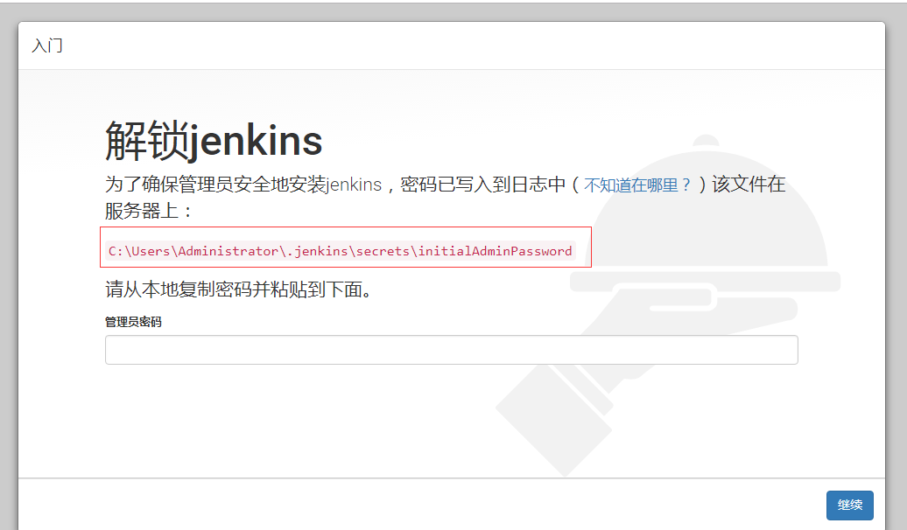

2) 密码输入成功后，可以进行推荐安装和自定义安装来选择安装所需插件，个人建议最好先选择推荐安装。

3) Jenkins启动成功后，可以用户-admin-配置去修改admin密码，便于自己登录。(可选)

4) 查看主目录路径（系统管理-->系统设置）确定是否是自己所要存放的位置，
    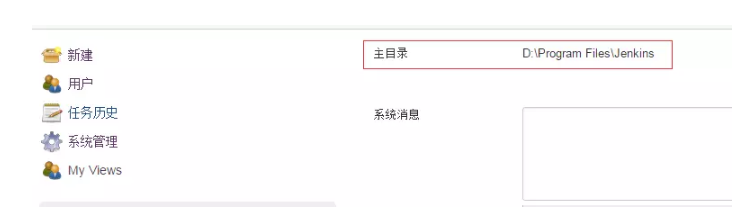

5) 如果不符合可以修改主目录：新建系统变量JENKINS_HOME，添加自己的路径，重启Jenkins。(可选)
    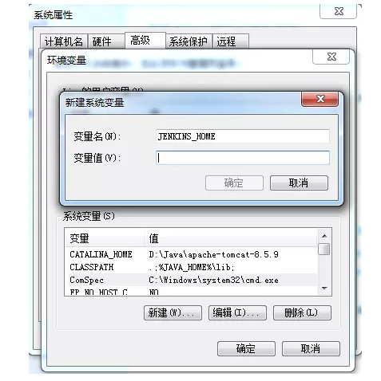

## 三、系统管理

1) 插件管理

    选择需要安装或更新的插件（如：gradle、svn等），也可以选择高级选项，上传已下载的插件。安装完成重启Jenkins。
        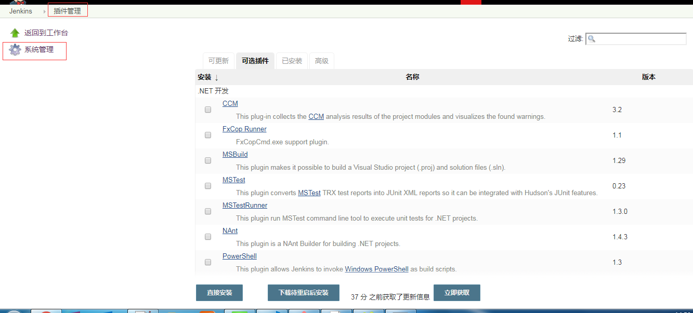

2) 全局工具配置

    全局工具配置，主要包括JDK、Gradle、Ant、Maven等。对于老版本Jenkins，没有“Global Tool Configuration”选项，可选择在“系统设置”中设置。
        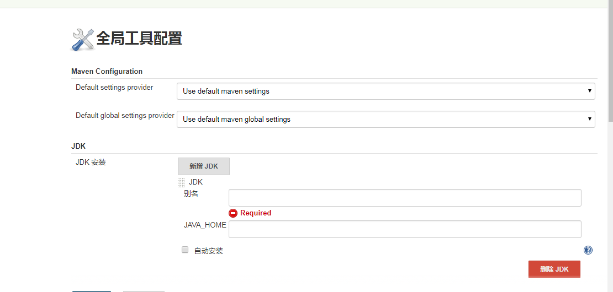

3) 管理用户

    创建/删除/修改Jenkins用户。
        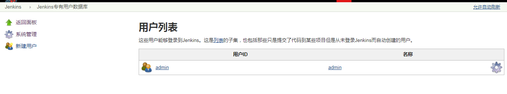

4) 全局安全设置

    可根据需求设置用户权限，主要是对“授权策略”设置。 
        

## 四、项目配置

1) Jenkins首页点击“新建”或点击“创建新任务”。

    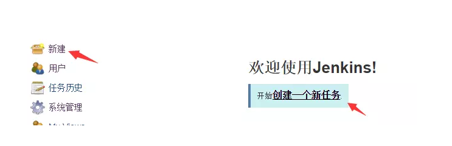

2) 选择“构建一个自由风格的软件项目”，输入项目名字。

    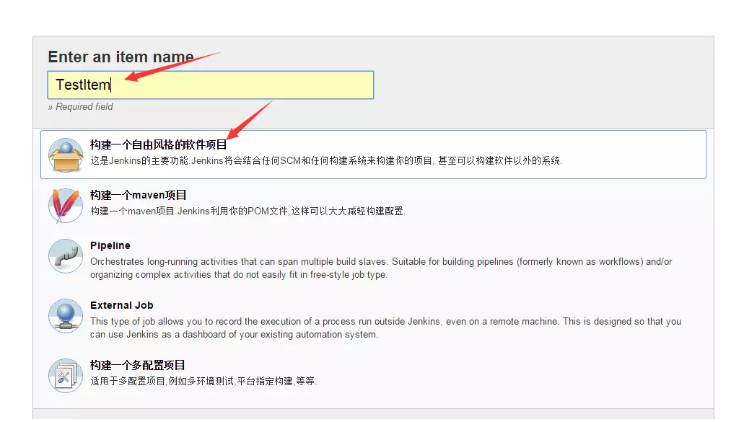

3) 源码管理，这里添加svn源码。

    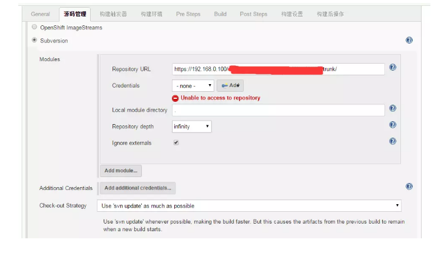
    如上图显示，添加svn路径后，显示“Unable to access to repository”,提示需要添加证书，点击add，输入svn用户名和密码创建即可。记得在“Credentials”选择刚才添加的证书。

4) 构建，选择“Invoke Gradle Script”。当选择“Use Gradle Wrapper”时，第一次构建项目需要下载gradle包，所以一般建议选择“Invode Gradle”。
    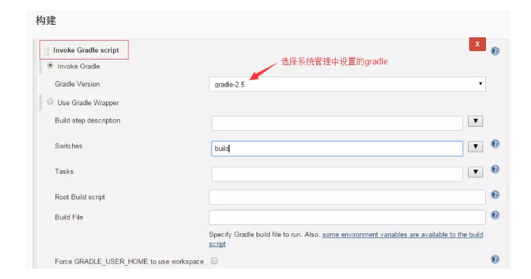

## 五、项目构建

1) 构建：点击添加的项目，选择立即构建，构建项目。

    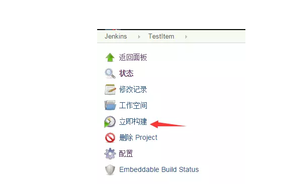

2) 构建输出：构建失败时，通过查看“Console Output”，查找构建失败原因。

    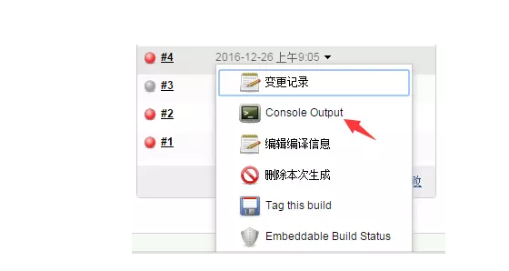

