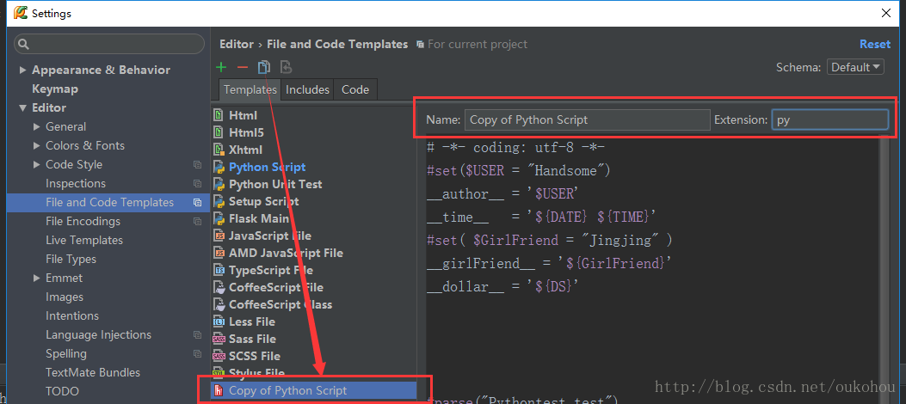

# 自动添加文件头、时间日期等信息

1. 打开PyCharm，选择File--Settings

2. 依次选择Editor-- File and Code Templates---Python Script

3. 创建模板

    1. 在原有模板添加新的信息

    可以根据需要添加相应的信息
    #!/usr/bin/python3
    可用的预定义文件模板变量为：
    $ {PROJECT_NAME} - 当前项目的名称。
    $ {NAME} - 在文件创建过程中在“新建文件”对话框中指定的新文件的名称。
    $ {USER} - 当前用户的登录名。
    $ {DATE} - 当前的系统日期。
    $ {TIME} - 当前系统时间。
    $ {YEAR} - 今年。
    $ {MONTH} - 当月。
    $ {DAY} - 当月的当天。
    $ {HOUR} - 目前的小时。
    $ {MINUTE} - 当前分钟。
    $ {PRODUCT_NAME} - 将在其中创建文件的IDE的名称。
    $ {MONTH_NAME_SHORT} - 月份名称的前3个字母。 示例：1月，2月等
    $ {MONTH_NAME_FULL} - 一个月的全名。 示例：1月，2月等

    2. 复制原有模板

    

    

    3. 选择文件保存为模板(选择文件,点击菜单的Tools--->Save File as Template)

    

    4. 模板引用其他include模板

    

    