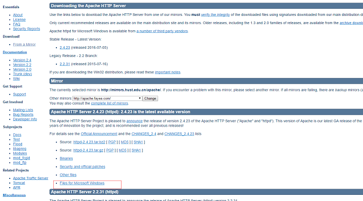
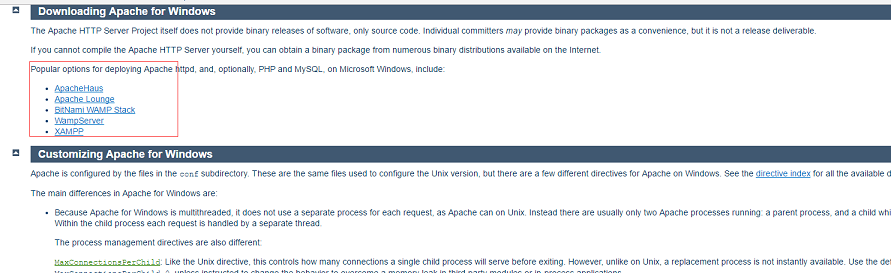
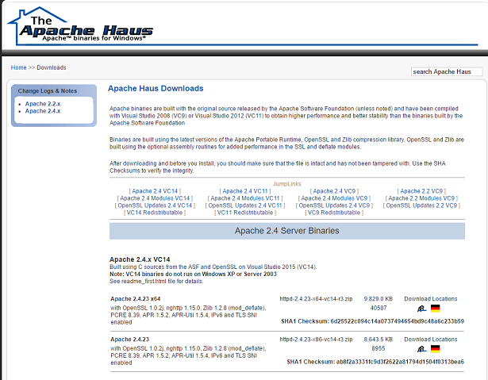
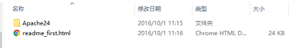
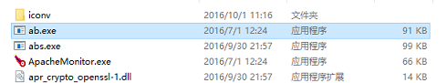
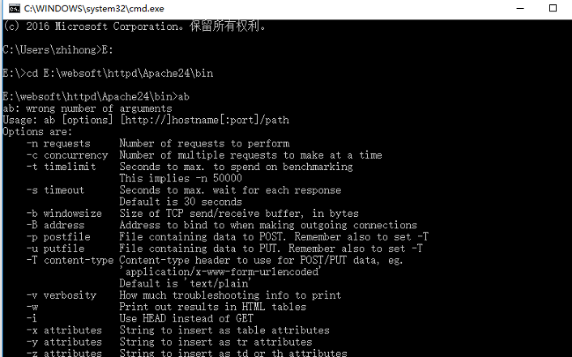
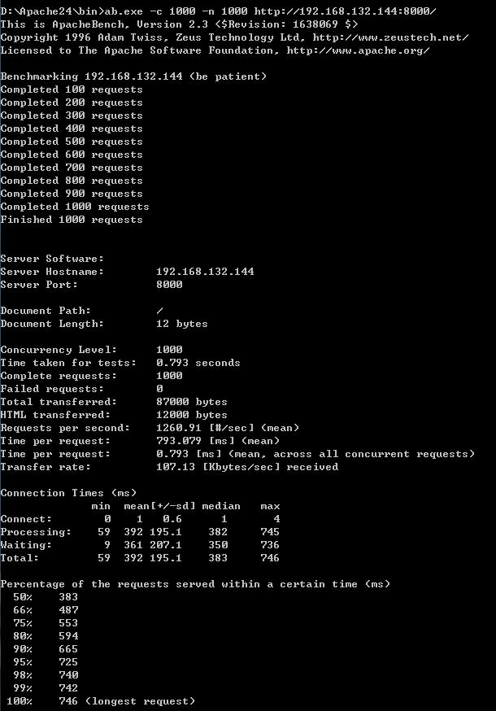

# 入门教程

概述
==

　　ab是apache自带的压力测试工具，当安装完apache的时候，就可以在bin下面找到ab然后进行apache 负载压力测试。

　　后台测试开发中，常用的压力测试服务，php一般选择xampp，下载地址：点击打开链接，java后台，如果你选用apache，apache http自带了ab压力测试工具，地址：点击打开链接。

下面以apache http server介绍ab压力测试。

**安装**

[下载](http://httpd.apache.org/)

注：

　　PHP官方推荐httpd使用prefork(php能更稳定地运行),而不是线程化的worker和event,httpd-2.4.x默认使用线程化的event作为mpm。

　　Linux上很多PECL库都是非线程安全的,libphp5.so在线程化的httpd(event/worker)中运行可能会出现一些问题,为了保持兼容性和稳定性,PHP一般还是使用httpd-2.2.x(prefork)这个分支。

**选择具体的类型**

注：后两个是有名的wamp以及xampp集成环境，如果只想下载apache可以选择前三个网站，这里我们第一个ApacheHaus为例。[点击打开链接](https://www.apachehaus.com/cgi-bin/download.plx)

这里需要说明的是：
httpd-2.2.x(prefork)
httpd-2.4.x(event) 编译时可以使用--with-mpm=prefork手动指定其使用prefork

下载完后解压，ab.exe程序就在E:\Apache24\bin中（这里可以将httpd -k install，把apache安装成windows后台服务），这里我们直接使用ab命令测试

使用ab命令

这里我们没有服务器，所以这段讲解用网络的图片。如我们使用下面的命令
# ab -n1000 -c10 http://192.168.116.193/index.html    #表示每次并发10个请求，总共请求1000次
我先在linux上启动一个node程序，此时访问地址是：http://192.168.132.144:8000/             打开cmd进入到bin目录中，输入ab.exe -c 1000 -n 1000 http://192.168.132.144:8000/         注意最后一个/必须要输入

**ab的其他命令**

格式： ./ab [options] [http://]hostname[:port]/path
Ab命令参数注释：
　　-n    #指定在测试会话中所执行的请求个数。默认时，仅执行一个请求。　
　　-c    #指定一次产生的请求个数。默认是一次一个。
　　-t    #测试所进行的最大秒数。其内部隐含值是-n 50000。它可以使对服务器的测试限制在一个固定的总时间以内。默认时，没有时间限制。
　　-p    #包含了需要POST的数据的文件.
　　-T    #POST数据所使用的Content-type头信息。
　　-v    #设置显示信息的详细程度 - 4或更大值会显示头信息， 3或更大值可以显示响应代码(404, 200等), 2或更大值可以显示警告和其他信息。 -V 显示版本号并退出。
　　-w    #以HTML表的格式输出结果。默认时，它是白色背景的两列宽度的一张表。
　　-I    #执行HEAD请求，而不是GET。

