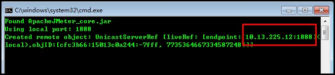

# Jmeter分布式部署测试

## Jmeter分布式执行原理：

1. Jmeter分布式测试时，选择其中一台作为控制机(Controller)，其它机器做为代理机(Agent)。
2. 执行时，Controller会把脚本发送到每台Agent上，Agent 拿到脚本后开始执行，Agent执行时不需要启动Jmeter，只需要把jmeter-server.bat文件打开，它应该是通过命令行模式来执行的。
3. 执行后，Agent会把结果回传给Controller，Controller会收集所有Agent的信息并汇总。

## 代理机(Agent)配置：

1. 修改端口:修改jmeter/bin/jmeter.proerties,如下两个配置项(可选,不修改为默认端口)
    * server_port=1888
    * server.rmi.localport=1888

2. 启动slave机上的jmeter，如下图，端口已经修改为：1888
    * Windows:JMETER_HOME/bin/jmeter-server.bat
    * Linux:JMETER_HOME/bin/jmeter-server
    

## 调度机（master）配置：

1. 配置从机端口和IP:修改JMETER_HOME/bin/jmeter.proerties,IP和Port是slave机的IP以及自定义的端口,多台slave之前用","隔开
    * remote_hosts=10.13.223.202:1000,10.13.225.12:1000

2. 启动slave机:
    * Windows:打开JMETER_HOME/bin/jmeter.bat,选择运行-远程全部启动
    * Linux:
        * JMETER_HOME/bin/jmeter -n -t testplan/comic.jmx -r -l testResult/result1.jtl 启动所有从机执行脚本并生成聚合报告
        * JMETER_HOME/bin/jmeter -n -t testplan/comic.jmx -R 10.15.243.53,10.15.230.78 -l testResult/result1.jtl    指定从机IP
            * -n表示以nogui方式运行测试计划
            * -t表示测试计划，后面跟测试计划名称
            * -l表示测试结果，后面跟测试结果文件名称
            * -r表示指定从机执行

## 问题

### 问题1

报错：Could not find ApacheJmeter_core.jar
解决办法：创建环境变量JMETER_HOME为Jmeter安装路径

### 问题2

报错：Server failed to start: java.rmi.server.ExportException: Listen failed on port:
解决办法：修改JMETER_HOME/bin/jmeter.proerties:server.rmi.ssl.disable=true

## 注意事项

1. JMeter版本保持一致
2. JDK版本保持一致，否则可能出现各种其他的问题
3. 尽量在linux环境下,从机和调度机不要在同一台机器上