# 使用指南

一 简介
--

Postman是一款功能超级强大的用于发送 HTTP 请求的 Chrome插件 。做web页面开发和测试的人员应该是无人不晓无人不用！其主要特点特点：
创建 + 测试：创建和发送任何的HTTP请求，请求可以保存到历史中再次执行
Organize:使用Postman Collections为更有效的测试及集成工作流管理和组织APIs
document:依据你创建的Clollections自动生成API文档,并将其发布成规范的格式
collarorate:通过同步连接你的team和你的api，以及权限控制，API库

**准备**

1. 下载安装postman（具体安装方法这里不赘述，见http://www.cnplugins.com/devtool/postman/）
2. 设置环境变量

有时需要在不同的环境下跑相同的测试，此时可以通过设置环境变量来动态选择。点击右上角的设置按钮：

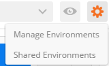


填写该环境的名称：如测试环境，并在key和value中填写需要的键值

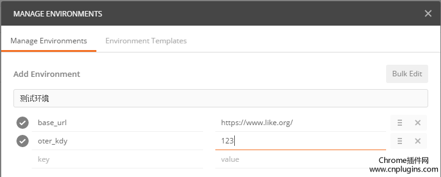

使用这些键值的时候只需要加上两个花括号引用key

**{{url_base}}/username**
解析完后
>建立多个环境时，key通常都是相同的，只是value不同

创建好所有环境后，在跑用例的时候在右上角下拉列表选择需要的环境就好

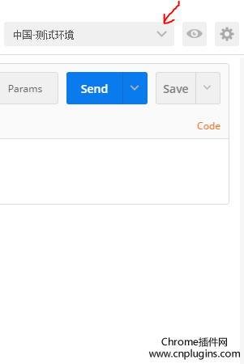

# 二 请求

postman界面分为两部分：左边的sidebar 右边的request builder：快速创建几乎所有的请求

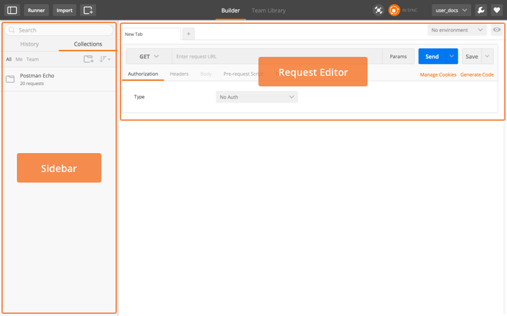

HTTP请求的4部分:URL，请求的method，headers，body。

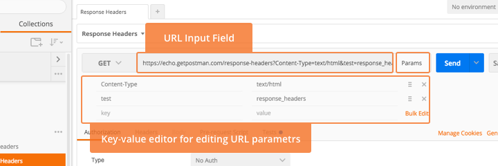

**URL**

首先需要设置的就是URL


注意：如果在输入参数时，没有自动decode到URL中，则可以选中参数右键后，选择EncodeURIComponent（一般都会自动填充的）：

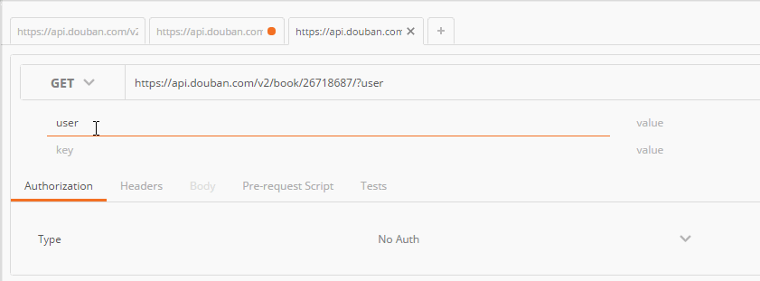

同样也可以decode，将参数生成dictionary的形式（一般都会自动填充的）：

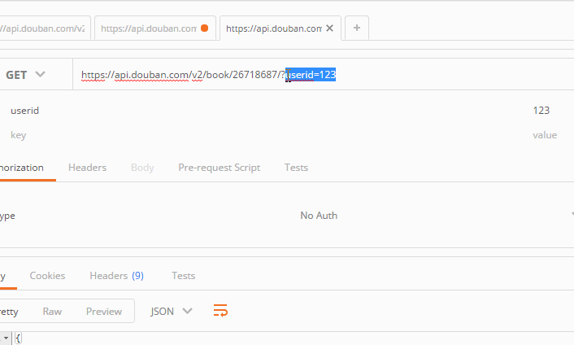

有的URL中有path变量，postman可以自动提取该path变量为一个key
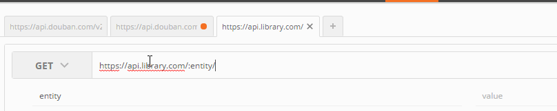

点击headers toggle：

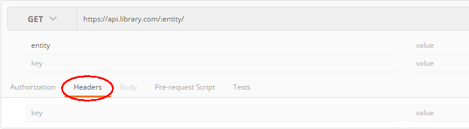

输入key-value时，会有自动提示的下拉面板：

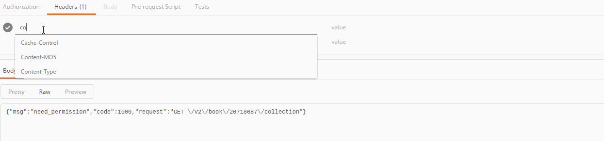

有些headers和cookies是保密的，如：

    1.Accept-Charset
    2.Accept-Encoding
    3.Access-Control-Request-Headers
    4.Access-Control-Request-Method
    5.Connection
    6.Content-Length
    7.Cookie
    8.Cookie 2
    9.Content-Transfer-Encoding
    10.Date
    11.Expect
    12.Host
    13.Keep-Alive
    14.Origin
    15.Referer
    16.TE
    17.Trailer
    18.Transfer-Encoding
    19.Upgrade
    20.User-Agent
    21.Via
postman 0.9.6版本后，这些限制可以解除：
点击右上角的Interceptor 安装这个：


**cookies**


分开打包的应用程序运行在沙箱浏览器,它不能访问cookie设置浏览器内。这种限制也可以使用拦截器扩展。
**Method**

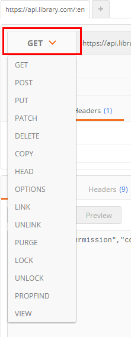


**Request body**

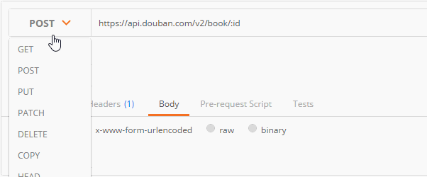

**不同的body editor 分为4个区域,根据body类型有不同的控制。**

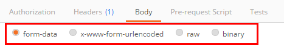

**mutipart/form-data是网页表单用来传输数据的默认格式。可以模拟填写表单，并且提交表单。**

可以上传一个文件作为key的value提交(如上传文件)。但该文件不会作为历史保存，只能在每次需要发送请求的时候，重新添加文件。

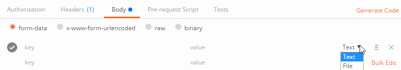

**2 urlencoded**

同前面一样，注意,你不能上传文件通过这个编码模式。
该模式和表单模式会容易混淆。urlencoded中的key-value会写入URL，form-data模式的key-value不明显写入URL，而是直接提交。

**3 raw**

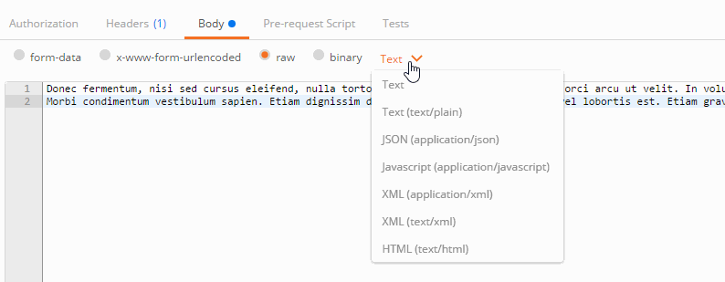

raw request可以包含任何东西。所有填写的text都会随着请求发送。

**4 binary**

image, audio or video files.text files 。 也不能保存历史，每次选择文件，提交。

三 响应
----

保证API响应的正确性，就是你需要做的大部分工作。postman的response viewer部分会协助你完成该工作且使其变得简单。
一个API的响应包含body,headers,响应状态码。postman将body和headers放在不同的tabs中。响应码和响应时间显示在tabs的旁边。将鼠标悬停在响应码上面可以查看更详细的信息。

* 1.保存responses

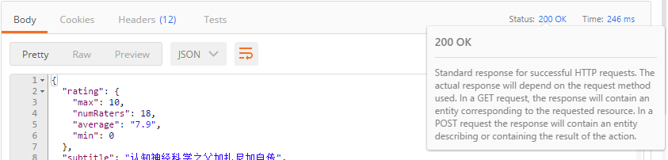

* 2 查看responses

三种视图查看body：

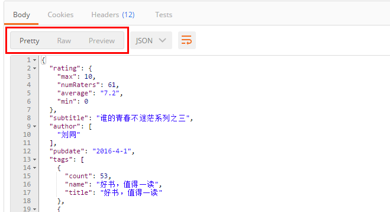


**Pretty**

格式化了JSON和XML，方便查看。 点击里面的URL，postman会创建一个request：

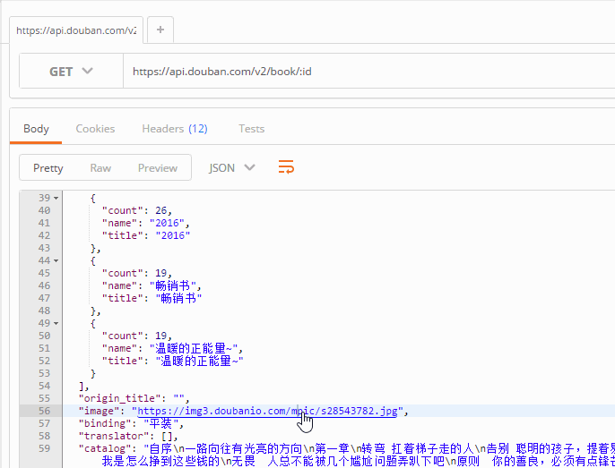

点击左边的三角可以折叠展开：

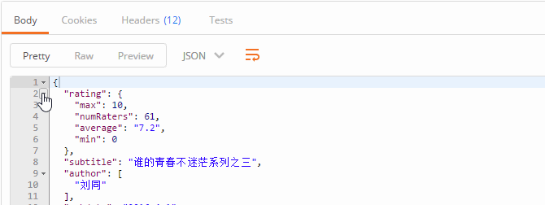

postman自动格式化body必须保证返回了正确的Content-Type.如果API没有返回，则可以点击”Force JSON“来设置。

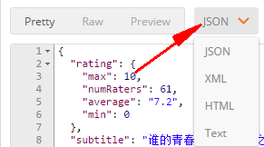

**Raw**

是text。

**preview**

有的浏览器会返回HTML的错误，对于找问题比较方便。由于sandbox的限制，js和图片不会显示在这里的iframe中。你可以maximize该body窗口方便查看结果。
Headers key-value形式展示。鼠标悬停在headers标签上，有详细的HTTP说明。

**cookies**

可以显示browser cookies，需要开启Interceptor。

**身份验证Authentication**

postman有一个helpers可以帮助我们简化一些重复和复杂的任务。当前的一套helpers可以帮助你解决一些authentication protocols的问题。

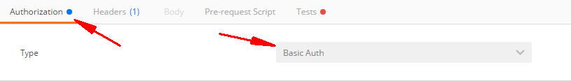


**Basic Auth**

填写用户名和密码，点击Refresh headers

**Digest Auth**

要比Basic Auth复杂的多。使用当前填写的值生成authorization header。所以在生成header之前要确保设置的正确性。如果当前的header已经存在，postman会移除之前的header。

**OAuth 1.0a**

postman的OAuth helper让你签署支持OAuth 1.0基于身份验证的请求。OAuth不用获取access token,你需要去API提供者获取的。OAuth 1.0可以在header或者查询参数中设置value。

**OAuth 2.0**

postman支持获得OAuth 2.0 token并添加到requests中。

四 Writting Test
--

Postman的Tests标签可以用来写测试：

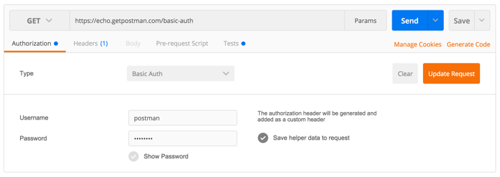

本质上是javascript code，可以为tests object设置values。这里使用描述性文字作为key，检验body中的各种情况，当然你可以创建任意多的key，这取决于你需要测试多少点。 tests也会随着request保存到collection中。api测试保证前端后台都能正常的于api协作工作，而不用在出错时猜测是哪里的问题。 需要在request的test中创建了test后，再进行request，test的结果在body的test中查看。 注意： 1.这里的key描述必须是唯一的，否则相同描述只会执行第一个。 2.这里的key可以使用中文。 例子： tests[“Body contains user_id”] = responseBody.has(“user_id”)
这里描述性的key为：Body contains user_id。检测点为：responseBody.has(“user_id”)，意思是检测返回的body中是否包含”user_id”这个字段。
查看responses中的Tests结果：记过显示每个key,也就是我们测试点的具体结果，是否通过。

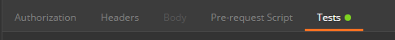

**Testing Sandbox**

postman的测试是运行在沙箱环境，是与app独立的。查看什么在沙箱中是可用的，参见Sandbox documentation.

**Snippets**

用于快速添加常用的测试代码。可以自定义snippets。

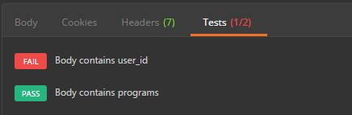

**Viewing results**

postman每次执行request的时候，会执行tests。测试结果会在tests的tab上面显示一个通过的数量。

**Testing Sandbox**

**Testing examples**

测试代码会在发送request并且接收到responses后执行。
```
1.设置环境变量 postman.setEnvironmentVariable("key", "value");
2.设置全局变量 postman.setGlobalVariable("key", "value");
3.检查response body中是否包含某个string tests["Body matches string"] =responseBody.has
("string_you_want_to_search");
4.检测JSON中的某个值是否等于预期的值
var data = JSON.parse(responseBody);tests["Your test name"] = data.value === 100;
JSON.parse()方法，把json字符串转化为对象。parse()会进行json格式的检查是一个安全的函数。 如：检查json中某个数组元素的个数(这里检测programs的长度)
var data = JSON.parse(responseBody);tests["program's lenght"] = data.programs.length === 5;
5.转换XML body为JSON对象 var jsonObject = xml2Json(responseBody);
6.检查response body是否与某个string相等 tests["Body is correct"] = responseBody === "response_body_string";
7.测试response Headers中的某个元素是否存在(如:Content-Type)
tests["Content-Type is present"] = postman.getResponseHeader("Content-Type"); //getResponseHeader()方法会返回header的值，如果该值存在
或者：
tests["Content-Type is present"] = responseHeaders.hasOwnProperty("Content-Type");
上面的方法，不区分大小写。下面的方法，要区分大小写。
```
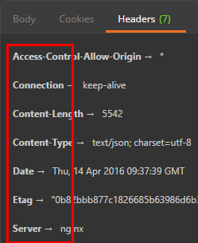
```
8.验证Status code的值 tests["Status code is 200"] = responseCode.code === 200;
9.验证Response time是否小于某个值 tests["Response time is less than 200ms"] = responseTime < 200;
10.name是否包含某个值 tests["Status code name has string"] = responseCode.name.has("Created");
11.POST 请求的状态响应码是否是某个值 tests["Successful POST request"] = responseCode.code === 201 || responseCode.code === 202;
12.很小的JSON数据验证器
var schema = { "items": { "type": "boolean" }};var data1 = [true, false];var data2 = [true, 123];console.log(tv4.error);tests["Valid Data1"] = tv4.validate(data1, schema);tests["Valid Data2"] = tv4.validate(data2, schema);
结果：
```
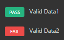

五 运行Collections
--
postman允许你运行collection，你可以运行任意的次数。 最后会给出一个整体运行的结果。会保存每一次运行的结果，提供给你比较每一次运行解雇的不同。
选择collection，选择环境。点击运行按钮。

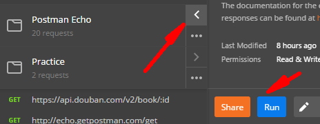

在需要csv和json文件的地方记得添加。
运行collection测试会在另一个窗口运行。如果需要在main窗口修改东西，在新窗口能正常读取。
