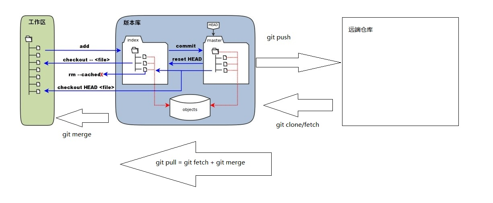

# Git 工作流程

我们先来理解下Git 工作区、暂存区、版本库和远端仓库概念

* 工作区(workspace)：就是你在电脑里能看到的目录。
* 暂存区(Index/Stage)：英文叫stage, 或index。一般存放在 ".git目录下" 下的index文件（.git/index）中，所以我们把暂存区有时也叫作索引（index）。
* 版本库(master)：工作区有一个隐藏目录.git，这个不算工作区，而是Git的版本库。
* 远端仓库(Remote): Git服务器的仓库(自己搭建或者托管平台),存储对应项目代码

一般工作流程如下：
1) git clone:克隆 Git 资源作为工作目录。
2) 在克隆的资源上添加或修改文件。注意：修改前保证代码的最新，不然提交可能产生冲突需要解决（git pull）
3) git add:提交修改或者新增到暂存库。
4) git diff:在提交前查看修改。如果错误，可以撤回提交（git reset HEAD）
5) git commit：提交修改到版本库。如果错误，可以撤回提交（git reset commit_id 或 git revert）
6) git push:提交修改到远端仓库。

工作流程图:

* 图中左侧为工作区，右侧为版本库。在版本库中标记为 "index" 的区域是暂存区（stage, index），标记为 "master" 的是 master 分支所代表的目录树。
* 图中我们可以看出此时 "HEAD" 实际是指向 master 分支的一个"游标"。所以图示的命令中出现 HEAD 的地方可以用 master 来替换。
* 图中的 objects 标识的区域为 Git 的对象库，实际位于 ".git/objects" 目录下，里面包含了创建的各种对象及内容。

* 当对工作区修改（或新增）的文件执行 "git add" 命令时，暂存区的目录树被更新，同时工作区修改（或新增）的文件内容被写入到对象库中的一个新的对象中，而该对象的ID被记录在暂存区的文件索引中。
* 当执行提交操作（git commit）时，暂存区的目录树写到版本库（对象库）中，master 分支会做相应的更新。即 master 指向的目录树就是提交时暂存区的目录树。
* 当执行 "git reset HEAD" 命令时，暂存区的目录树会被重写，被 master 分支指向的目录树所替换，但是工作区不受影响。
* 当执行 "git rm --cached <file>" 命令时，会直接从暂存区删除文件，工作区则不做出改变。
* 当执行 "git checkout ." 或者 "git checkout -- <file>" 命令时，会用暂存区全部或指定的文件替换工作区的文件。这个操作很危险，会清除工作区中未添加到暂存区的改动。
* 当执行 "git checkout HEAD ." 或者 "git checkout HEAD <file>" 命令时，会用 HEAD 指向的 master 分支中的全部或者部分文件替换暂存区和以及工作区中的文件。这个命令也是极具危险性的，因为不但会清除工作区中未提交的改动，也会清除暂存区中未提交的改动。