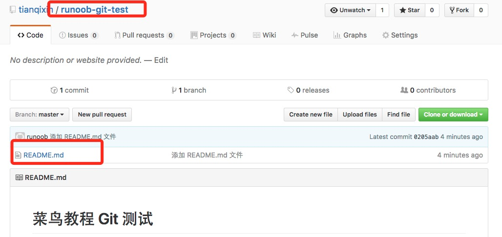

# Git 远程仓库
Git 并不像 SVN 那样有个中心服务器。

目前我们使用到的 Git 命令都是在本地执行，如果你想通过 Git 分享你的代码或者与其他开发人员合作。 你就需要将数据放到一台其他开发人员能够连接的服务器上。

* [Github](#Github)
* [Coding](#Coding)

## Github

一个拥有143万开发者的社区。其中不乏Linux发明者Torvalds这样的顶级黑客，以及Rails创始人DHH这样的年轻极客。

这个星球上最流行的开源托管服务。目前已托管431万git项目，不仅越来越多知名开源项目迁入GitHub，比如Ruby on Rails、jQuery、Ruby、Erlang/OTP；近三年流行的开源库往往在GitHub首发，例如：BootStrap、Node.js、CoffeScript等。

### 注册账户

要想使用github第一步当然是注册github账号了， [github官网地址](https://github.com/)。


### 配置Git

由于你的本地Git仓库和GitHub仓库之间的传输是通过SSH加密的，所以我们需要配置验证信息：

* 首先在本地创建ssh key；
    ```bash
    $ ssh-keygen -t rsa -C "your_email@youremail.com"
    ```
    后面的your_email@youremail.com改为你在github上注册的邮箱，之后会要求确认路径和输入密码，我们这使用默认的一路回车就行。成功的话会在~/下生成.ssh文件夹，进去，打开id_rsa.pub，复制里面的key。

* 回到github上，进入 Account Settings（账户配置），左边选择SSH Keys，Add SSH Key,title随便填，粘贴在你电脑上生成的key。
    
    

* 添加成功后界面如下所示
    

* 为了验证是否成功，输入以下命令：
```bash
$ ssh -T git@github.com
Hi tianqixin! You've successfully authenticated, but GitHub does not provide shell access.
```
以下命令说明我们已成功连上 Github。

### 创建仓库

* 登录Github后点击" New repository " 如下图所示：
    

* 之后在在Repository name 填入 runoob-git-test(远程仓库名) ，其他保持默认设置，点击"Create repository"按钮，就成功地创建了一个新的Git仓库：
    

* 创建成功后，显示如下信息：
    
    以上信息告诉我们可以从这个仓库克隆出新的仓库，也可以把本地仓库的内容推送到GitHub仓库。

### 提交代码到Github

现在，我们根据 GitHub 的提示，在本地的仓库下运行命令：
```bash
$ mkdir runoob-git-test                     # 创建测试目录
$ cd runoob-git-test/                       # 进入测试目录
$ echo "# 菜鸟教程 Git 测试" >> README.md     # 创建 README.md 文件并写入内容
$ ls                                        # 查看目录下的文件
README
$ git init                                  # 初始化
$ git add README.md                         # 添加文件
$ git commit -m "添加 README.md 文件"        # 提交并备注信息
[master (root-commit) 0205aab] 添加 README.md 文件
 1 file changed, 1 insertion(+)
 create mode 100644 README.md

# 提交到 Github
$ git remote add origin git@github.com:tianqixin/runoob-git-test.git
$ git push -u origin master
```
以下命令请根据你在Github成功创建新仓库的地方复制，而不是根据我提供的命令，因为我们的Github用户名不一样，仓库名也不一样。

接下来我们返回 Github 创建的仓库，就可以看到文件已上传到 Github上：
    


### 查看当前的远程库

* 要查看当前配置有哪些远程仓库，可以用命令：
    ```bash
    git remote
    ```

* 实例
    ```bash
    $ git remote
    origin
    $ git remote -v
    origin    git@github.com:tianqixin/runoob-git-test.git (fetch)
    origin    git@github.com:tianqixin/runoob-git-test.git (push)
    ```
    执行时加上 -v 参数，你还可以看到每个别名的实际链接地址。

### 提取远程仓库
Git 有两个命令用来提取远程仓库的更新。

1. 从远程仓库下载新分支与数据：
    ```bash
    git fetch
    ```
    该命令执行完后需要执行git merge 远程分支到你所在的分支。

2. 从远端仓库提取数据并尝试合并到当前分支：
    ```bash
    git merge
    ```
    该命令就是在执行 git fetch 之后紧接着执行 git merge 远程分支到你所在的任意分支。

* 假设你配置好了一个远程仓库，并且你想要提取更新的数据，你可以首先执行 git fetch [alias] 告诉 Git 去获取它有你没有的数据，然后你可以执行 git merge [alias]/[branch] 以将服务器上的任何更新（假设有人这时候推送到服务器了）合并到你的当前分支。

    接下来我们在 Github 上点击" README.md" 并在线修改它:

    

    * 然后我们在本地更新修改。
        ```bash
        $ git fetch origin
        remote: Counting objects: 3, done.
        remote: Compressing objects: 100% (2/2), done.
        remote: Total 3 (delta 0), reused 0 (delta 0), pack-reused 0
        Unpacking objects: 100% (3/3), done.
        From github.com:tianqixin/runoob-git-test
            0205aab..febd8ed  master     -> origin/master
        ```
        以上信息"0205aab..febd8ed master -> origin/master" 说明 master 分支已被更新.
    
    * 我们可以使用以下命令将更新同步到本地：
        ```bash
        $ git merge origin/master
        Updating 0205aab..febd8ed
        Fast-forward
        README.md | 1 +
        1 file changed, 1 insertion(+)
        ```
    
    * 查看 README.md 文件内容：
        ```bash
        $ cat README.md 
        # 菜鸟教程 Git 测试
        ## 第一次修改内容
        ```

### 推送到远程仓库

* 推送你的新分支与数据到某个远端仓库命令:
    ```bash
    git push [alias] [branch]
    ```
    以上命令将你的 [branch] 分支推送成为 [alias] 远程仓库上的 [branch] 分支.

* 实例如下
    ```bash
    $ touch runoob-test.txt      # 添加文件
    $ git add runoob-test.txt 
    $ git commit -m "添加到远程"
    master 69e702d] 添加到远程
    1 file changed, 0 insertions(+), 0 deletions(-)
    create mode 100644 runoob-test.txt

    $ git push origin master    # 推送到 Github
    ```

* 重新回到我们的 Github 仓库，可以看到文件以及提交上来了：
    


### 删除远程仓库

* 删除远程仓库你可以使用命令：
    ```bash
    git remote rm [别名]
    ```

* 实例
    ```bash
    $ git remote -v
    origin    git@github.com:tianqixin/runoob-git-test.git (fetch)
    origin    git@github.com:tianqixin/runoob-git-test.git (push)

    # 添加仓库 origin2
    $ git remote add origin2 git@github.com:tianqixin/runoob-git-test.git

    $ git remote -v
    origin    git@github.com:tianqixin/runoob-git-test.git (fetch)
    origin    git@github.com:tianqixin/runoob-git-test.git (push)
    origin2    git@github.com:tianqixin/runoob-git-test.git (fetch)
    origin2    git@github.com:tianqixin/runoob-git-test.git (push)

    # 删除仓库 origin2
    $ git remote rm origin2
    $ git remote -v
    origin    git@github.com:tianqixin/runoob-git-test.git (fetch)
    origin    git@github.com:tianqixin/runoob-git-test.git (push)
    ```


## Coding


>　　对于开发者而言 GitHub 已经不陌生了，在平时的开发中将代码托管到 GitHub 上十分方便。但是、国内用户通常会遇到一个问题就是： GitHub 的访问速度太慢。在阿里云和腾讯云的主机上 clone 代码时，如果主机的带宽不够大，clone 代码简直就是龟速。常常还会出现：丢包、失去连接等情况。对于这种情况，如果你想体验飞速的 Git 服务，不妨试着用一下 CODING 平台。相对于GitHub，CODING 除了提供免费的 Git 仓库之外，还给我们提供了免费的私有仓库（免费的普通会员提供 10 个私有项目、512M Git 仓库容量）。此外、CODING 还为我们免费提供了，项目管理、任务管理、团队管理、文件管理等功能，十分强大。

下面，我是试着来创建一个 CODING 项目，并且将 GitHub 上的代码迁移到 CODING。通常，分为三步：
* [创建 CODING 项目](#创建CODING项目)
* [将 GitHub 代码 Pull 到本地](#将GitHub代码Pull到本地)
* [本地关联 CODING 仓库，Push 代码到 CODING](#本地关联CODING仓库,Push代码到CODING)


### 创建CODING项目

登录 [CODING](https://coding.net/) 注册账号，让后在项目管理页面中创建项目，这一步不做赘述，按你的需要填写项目名称与描述，选择 License 类型即可，关于 License 的选择可以参考
下图。项目创建完成中，在右侧菜单栏中的代码选项卡可以对代码进行相关的管理与操作


### 将GitHub代码Pull到本地

登录 GitHub 选择你想要导入的仓库并复制仓库地址，在本地执行命令，将 GitHub 仓库代码拉下来：

```bash
git clone [复制仓库地址]
```

### 本地关联CODING仓库,Push代码到CODING
首先我们执行命令：git remote -v

可以看到，当前的 git 已经关联了一个远程仓库。

因此，接下来我们执行以下命令，来关联 CODING 远程仓库（后面的仓库地址需要替换为你的 CODING 项目的地址！） 第一条命令的作用是删除现有的仓库关联，后面两条命令则是将仓库关联到 CODING 的地址，并且将代码 Push 到 master 分支
```bash
git remote rm origin
git remote add origin https://git.coding.net/xxx/xxx.git
git push -u origin master
```
之后，我们再次进入 CODING 项目中代码管理的页面，便可以看到我们刚才 Push 上去的代码了。至此、GitHub 上的项目已经完整迁移到了 CODING 平台！


### CODING 仓库的免密码 Push/Pull
* 代码迁移到 CODING 之后，我们发现，每次 Push/Pull 代码的时候都会提示我们输入用户名和密码。这是因为，我们的项目还没有添加 SSH Key，只能通过用户名/密码验证。 而 CODING 是为我们提供了公钥验证的方式的，进入项目管理，在左侧选项卡中点击"公钥部署"按钮，然后点击右侧的"新建公钥部署"

* 我们将本地的公钥内容粘贴到对应位置，并且给公钥命名一下（查看/生成本机公钥，可以参考这篇博文：查看本机 ssh 公钥，生成公钥）。勾选"授予推送权限"则可以授予这台机器Push代码的权限。

* 保存好设置后，我们再次尝试。此时，Push/Pull 代码不在需要验证用户名密码。至此，我们的代码便完全托管在了 CODING 平台上，享受他的便捷与飞速吧！