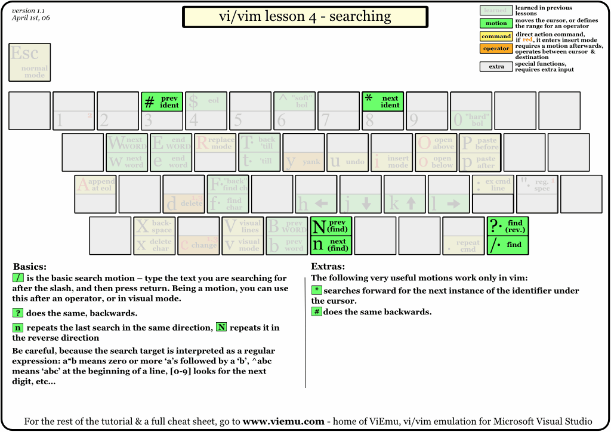

# Vim快捷键键位图

* [经典版](#经典版)
* [入门版](#入门版)
* [进阶版](#进阶版)
* [增强版](#增强版)
* [文字版](#文字版)

## 经典版

下面这个键位图应该是大家最常看见的经典版了。

对应的简体中文版

其实经典版是一系列的入门教程键位图的组合结果，下面是不同编辑模式下的键位图。

## 入门版

基本操作的入门版。

## 进阶版

## 增强版

## 文字版

